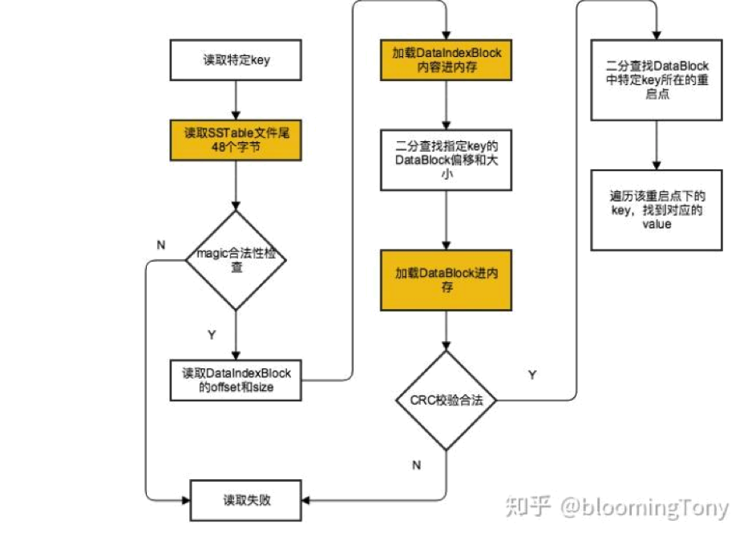

#1.SSTable Read

用户每次要访问一个 SSTable 时，只需要先读取 IndexBlock 和 MetaBlock，如果通过了 BloomFilter 的检验，再从 IndexBlock 的索引结构中判断应该读取哪个 DataBlock，这样只需再读取对应 DataBlock 就可以获得数据。

 
 

读取SST
前面我们介绍过Rocksdb的Get()接口，首先在Memtable中查找，之后是Immutable Memtable，最后再去SST文件中查找:
通过Version中记录的信息遍历Level中的所有SST文件，利用SST文件记录的边界最大，最小key- smallest_key和largest_key来判断查找的key是否有可能存在
如果在该Level中可能存在，调用TableReader的接口来查找SST文件
首先通过SST文件中的Filter来初判key是否存在
如果存在key存在，进入Data Block中查找
在Data Block利用Block的迭代器BlockIter利用二分查找BinarySeek或者前缀查找PrefixSeek
如果查找成功则返回，如果该Level不存在查找的Key，继续利用Version中的信息进行下一个Level的查找，直到最大的一个Level

