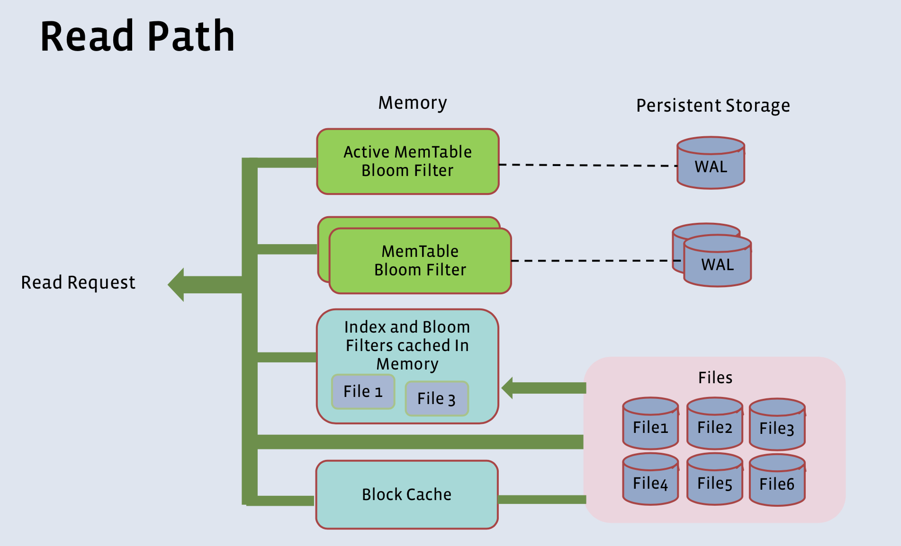
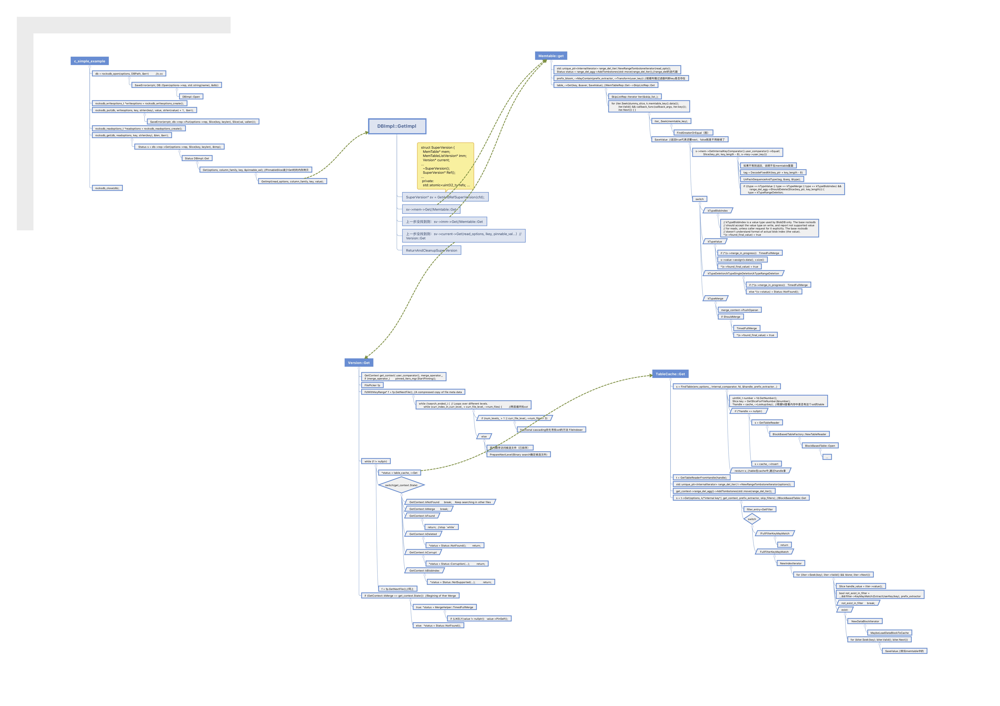
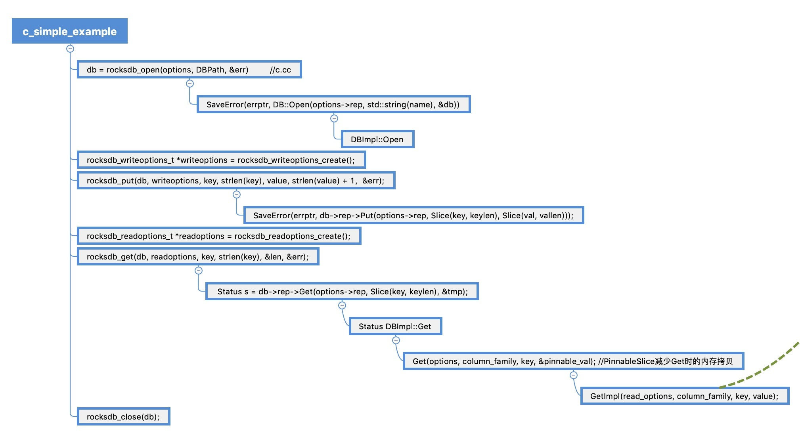
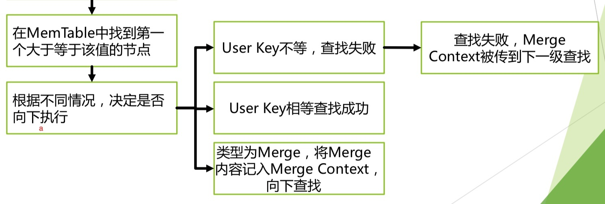
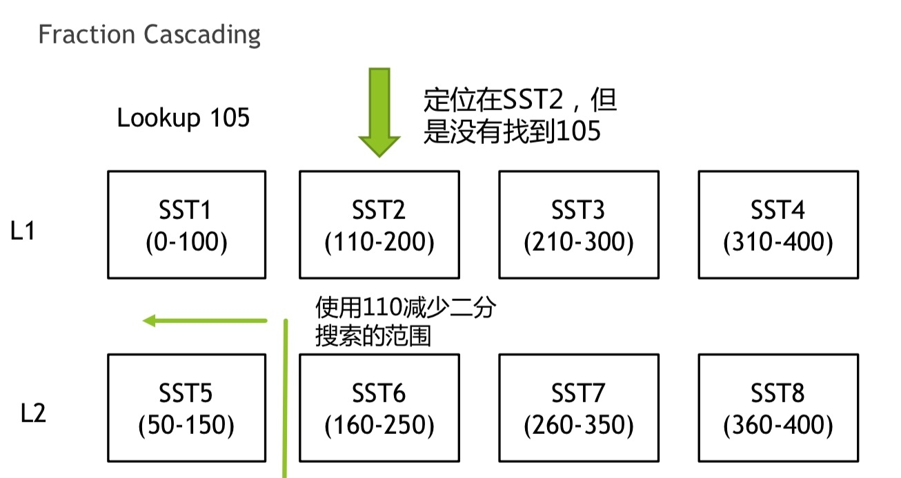
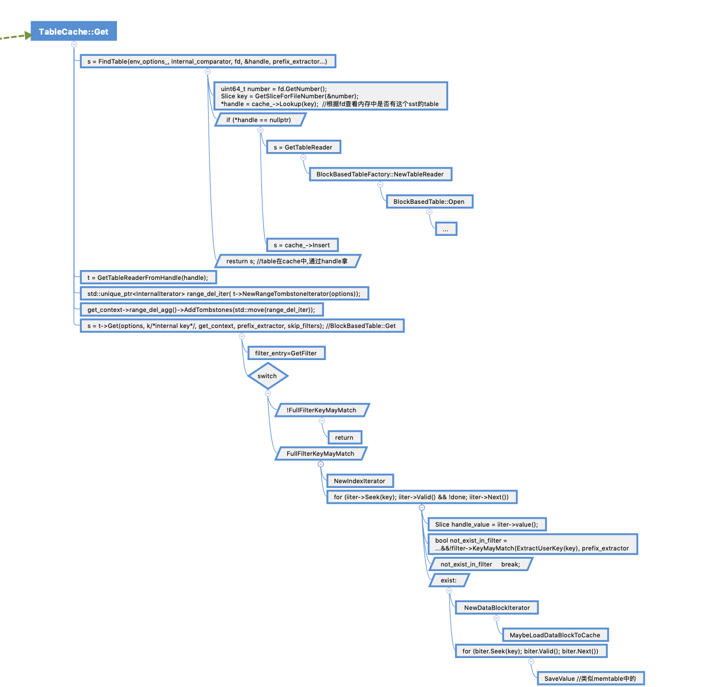

# [RocksDB 原理介绍：读过程源码分析]


# RocksDB 读流程源码分享


## 整体逻辑

RocksDB的读相关操作在逻辑上并不复杂，基本继承了LevelDB的流程步骤，但在细节上有了很多优化，并额外引入了column family的概念。  
  
当用户通过Get（）接口进行key-value pair搜索时，会拿到一个超级版本supper version，并依次从memtable、immutable memtable队列、sstable缓存中搜索。  


  
  

## 对外接口

  
RocksDB 对外提供了Get(key), Put(key), Delete(key) and NewIterator()等操作，我们可以直接从官方的文档里面找到测试程序，以此为入口开始代码分析（examples/c\_simple\_example.c）。  
代码中的rocksdb\_put、rocksdb\_get作为全局函数调用DB::put/DB:get接口，本质是调用的数据库实现类DBImpl的操作。  
写入过程中key和value被打包成slice对象传入put接口，写入WriteBatch，后续将批量写入Memtable。  
Slice由一个size变量和一个指向外部内存区域的指针构成。使用slice可以减少之后的key、value在传值过程中的拷贝操作。  
而在读的过程中，引入了PinnabeSlice作为引用出参，同样是减少内存拷贝，并做到了生命周期控制，防止block\_cache中的数据在返回前被释放，最终get不到数据的问题。（BlockIter退出前通过DelegateCleanUpsTo将cleanup交给PinnabeSlice）

## 数据库实现层逻辑

  
Rocksdb::DB是个抽象基类，其中定义些纯虚函数，包括Get，Put操作等，具体实现时调用它的子类rocksdb::DBImpl实现这些接口功能。Get的功能就是油DBImpl::GetImpl完成。  
其中通过SuperVersion可以找到当前的Memtable、Immutable Memtable队列、以及当前Version（由此可以找到当前版本的sstable结构中的所有文件），它是由columnfamily提供维护的。  
而Version时由一个时间点所有有效SST文件组成。每次campact完成，将会创建新的version。  
旧版本的super version和version在引用为零时会被清除。

## 在内存中搜索


在Memtable和Immutable memtable中搜索调用的函数是一致的。其默认实现是基于跳表完成的。跳表迭代器SkipListRep::Iterator iter通过FindGreaterOrEqual实现搜索定位，并根据获得目标对象的key决定是继续搜索还是返回结果。


值得注意的是，rocksdb引入了范围删除和Merge等运算操作，所以在值类型判断的时候要比leveldb复杂的多。



## 在sstable中搜索

如果在内存中没有得到结果，那么下一步就是从sstable中找寻了。但是这一步并不是马上会产生I/O,因为rocksdb/leveldb都做了一定程度的cache（table cache/block cache），只有cache中没有的时候才回去读磁盘。  


这里面有两个函数值得注意，一个是GetNextFile（）明确了我们每一次去读哪个文件，按什么顺序读。另一个是TableCache::Get明确了每个文件我们怎么读里面的内容。

在GetNextFile中，RocksDB实现了一个基于FileIndexer得fractional cascading优化寻找sst算法。常规的办法是通过两层循环先在每层内全局二分搜索，然后从0层循环到最高层。通过维护FileIndexer，对于第1层以上的层且层文件数多于3个时，可以根据之前上一层读过的最后一个文件的key-range和要搜索的key值，对本层要读的sstable文件进行范围收紧。这里有最多五种不同情况，每一种都可以至少确定一个right\_bound或者left\_bound。  


另外一个函数是TableCache::Get。  


其中的FindTable实现从缓存中去拿选出的sstable文件的基本元信息，如果缓存里面没有就需要先创建（BlockBasedTable::Open）一个，同时还要插入缓存（cache\_->Insert）。Open涉及的内容很多，主要是通过读footer在TableReader对象里面缓存meta block和index block里面的信息。  
然后就是BlockBasedTable::Get去根据table拿到key-value了。首先考虑拿过滤器判断想搜索的内容是否可能存在。接着用NewIndexIterator去seek值被包括的块，优先尝试从cache中读这个快，然后再考虑用过滤器判断值是否在块内，最后用 NewDataBlockIterator去seek快内的值。最后SaveValue按照key-value的类型决定返回还是继续搜索。  


  


## 其他

1.

In-place updates for equal keys and similar sized values

Summary:  
Currently for each put, a fresh memory is allocated, and a new entry is added to the memtable with a new sequence number irrespective of whether the key already exists in the memtable. This diff is an attempt to update the value inplace for existing keys. It currently handles a very simple case:  
1\. Key already exists in the current memtable. Does not inplace update values in immutable memtable or snapshot  
2\. Latest value type is a 'put' ie kTypeValue  
3\. New value size is less than existing value, to avoid reallocating memory

In-place updates with callback function  
existing\_value - pointer to previous value (from both memtable and sst). nullptr if key doesn't exist  
existing\_value\_size - pointer to size of existing\_value). nullptr if key doesn't  
exist delta\_value - Delta value to be  
merged with the existing\_value. Stored in transaction logs. merged\_value - Set when delta is applied on the previous value.

UpdateStatus (\*inplace\_callback)(char\* existing\_value,

\`\`\`  
UpdateStatus (\*inplace\_callback)(char\* existing\_value, uint32\_t\* existing\_value\_size, Slice delta\_value, std::string\* merged\_value)  
\`\`\`  
  
Applicable only when inplace\_update\_support is true, this callback function is called at the time of updating the memtable as part of a Put operation, lets say Put(key, delta\_value). It allows the 'delta\_value' specified as part of the Put operation to be merged with an 'existing\_value' of the key in the database.  
If the merged value is smaller in size that the 'existing\_value', then this function can update the 'existing\_value' buffer inplace and the corresponding 'existing\_value'\_size pointer, if it wishes to. The callback should return UpdateStatus::UPDATED\_INPLACE. In this case. (In this case, the snapshot-semantics of the rocksdb Iterator is not atomic anymore).  
If the merged value is larger in size than the 'existing\_value' or the application does not wish to modify the 'existing\_value' buffer inplace, then the merged value should be returned via \*merge\_value. It is set by merging the 'existing\_value' and the Put 'delta\_value'. The callback should return UpdateStatus::UPDATED in this case. This merged value will be added to the memtable.  
If merging fails or the application does not wish to take any action, then the callback should return UpdateStatus::UPDATE\_FAILED.  
Please remember that the original call from the application is Put(key, delta\_value). So the transaction log (if enabled) will still contain (key, delta\_value). The 'merged\_value' is not stored in the transaction log. Hence the inplace\_callback function should be consistent across db reopens.

2.

```plain
class LookupKey {
 public:
  // Initialize *this for looking up user_key at a snapshot with
  // the specified sequence number.
  LookupKey(const Slice& _user_key, SequenceNumber sequence);

  ~LookupKey();

  // Return a key suitable for lookup in a MemTable.
  Slice memtable_key() const {
    return Slice(start_, static_cast<size_t>(end_ - start_));
  } //在memtable中值比较时使用

  // Return an internal key (suitable for passing to an internal iterator)
  Slice internal_key() const {
    return Slice(kstart_, static_cast<size_t>(end_ - kstart_));
  }//在sst中值比较时使用

  // Return the user key
  Slice user_key() const {
    return Slice(kstart_, static_cast<size_t>(end_ - kstart_ - 8));
  }

 private:
  // We construct a char array of the form:
  // klength varint32 <-- start_
  // userkey char[klength] <-- kstart_
  // tag uint64
  // <-- end_
  // The array is a suitable MemTable key.
  // The suffix starting with "userkey" can be used as an InternalKey.
  const char* start_;
  const char* kstart_;
  const char* end_;
  char space_[200];      // Avoid allocation for short keys

  // No copying allowed
  LookupKey(const LookupKey&);
  void operator=(const LookupKey&);
};
```

  


  
  
排序时，squence大的排在前面，即seek时默认读到最新的值。  

