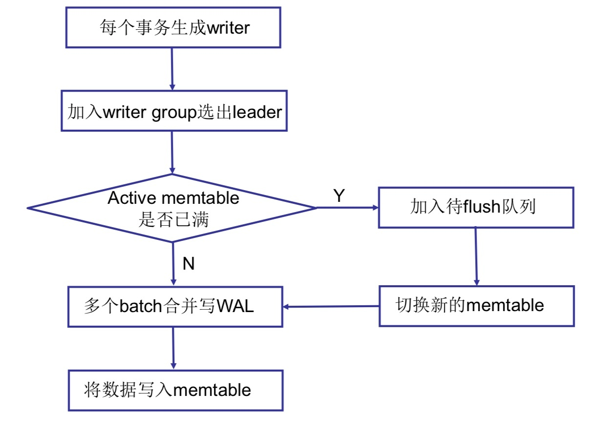
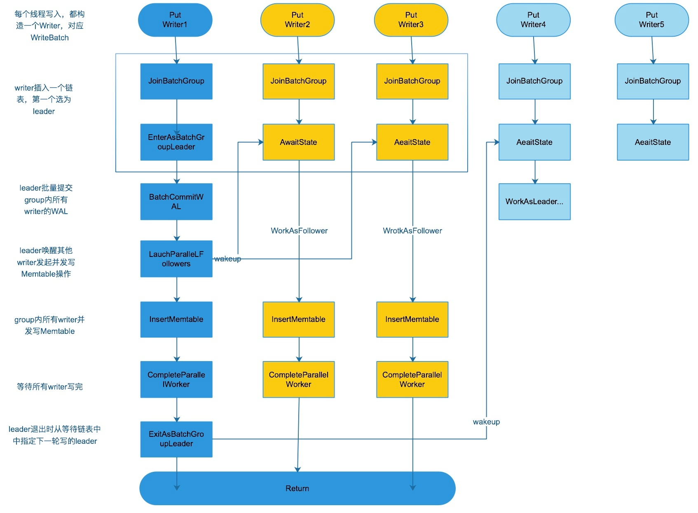
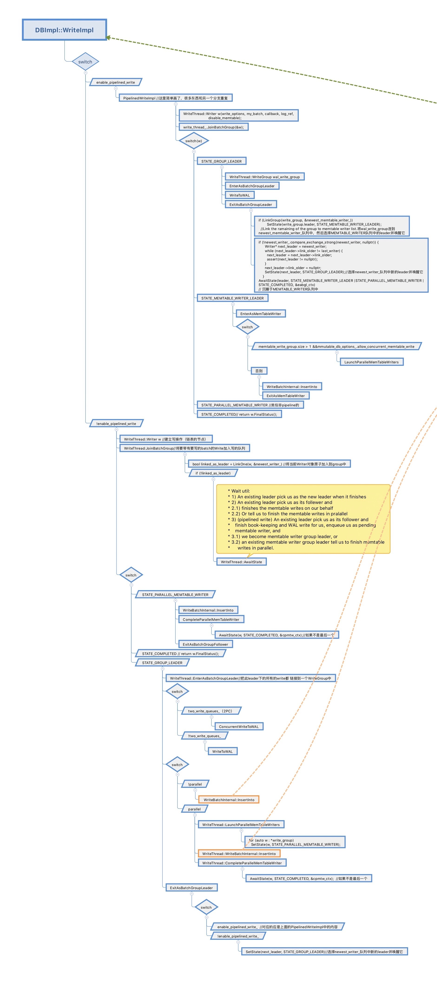
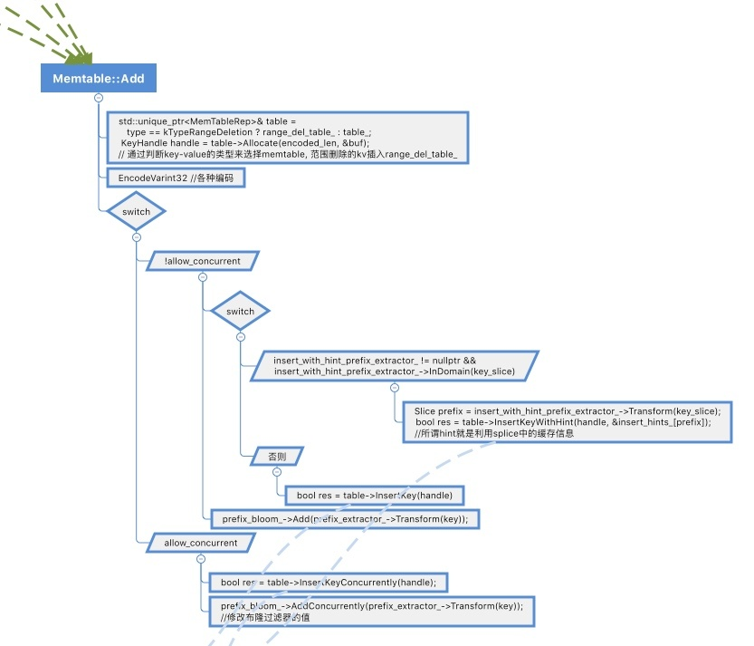
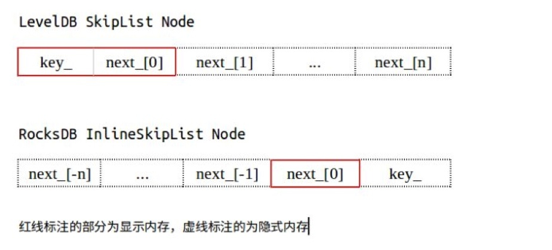
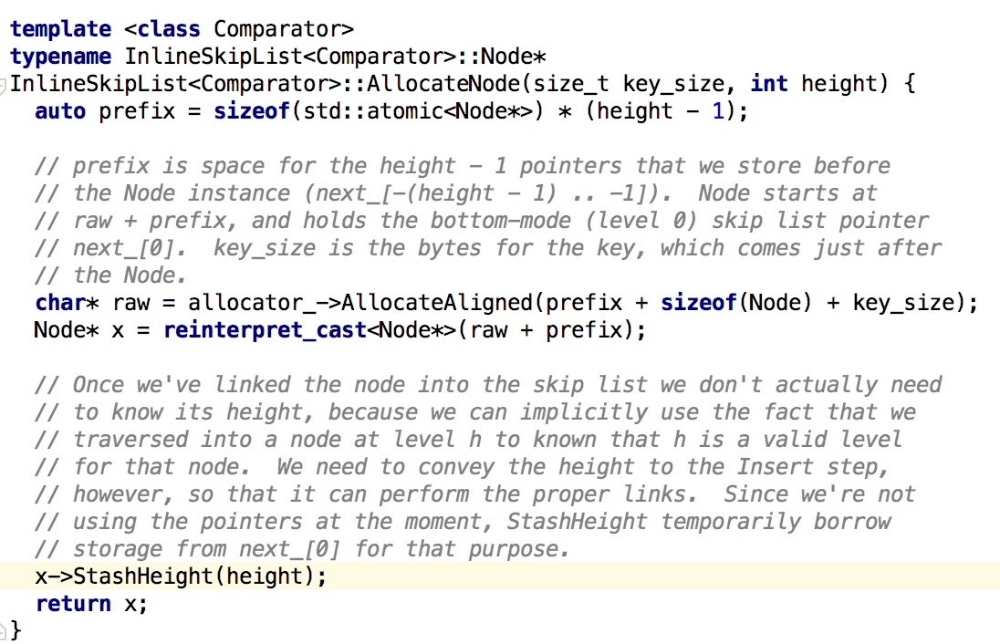

# [RocksDB 原理介绍：写过程源码分析]

# RocksDB 写流程源码分享

## 一、整体逻辑

Rocksdb的写入性能十分优秀，下面梳理一下大概的逻辑流程。  
  
RocksDB整体框架如上图所示。

*   Memtable：KV在内存中的存储结构，有序的，可读写，默认用SkipList实现。
*   Immutable Memtable：与Memtable结构一样，区别是只读。
*   SSTable：Immutable Memtable写入到文件后的结构，有多层，只读。
*   WAL：写操作日志记录，用于重启后恢复内存中尚未持久化的数据。
*   MANIFEST：记录当前有效的SSTable。
*   CURRENT：记录当前有效的MANIFEST。

插入操作比较好理解，直接写入writebatch就可 以了。

 删除操作在writebatch里本质上也是写入，只不过是标记了待删除的key。

 对应到Myrocks，如果更新主键或二级索引（RocksDB的key区域），会删除原有记录，插入新纪录，其他情况会直接插入新数据不会删除原有的数据。

  

在具体写入数据时，会先写WAL日志，然后将key-value插入Memtable，Memtable满了或者其他条件被触发后会构造新的Memtable，并将老的Memtable转化为只读的immutable Memtable。immutable Memtable达到一定数量后需要刷盘成为SStable，初始层号为L0，后期L0还将通过compact向高层级合  
并。  
  
以上就是RocksDB在LSM数理论上的实现逻辑。下面我们透过代码来看具体实现。选用的版本为github/facebook/rocksdb，2018年7月11日版本（commit：35b38a232c1d357a7a885b9b4b8442e24a8433d7 ）

我们可以将实现过程大致抽象为：外部接口层、数据库逻辑层、WriteBatch层、Memtable层，再往下还有跳表层操作，以及后续的Memtable切换和Flush到SStable等操作。

## 二、对外接口

RocksDB 对外提供了Get(key), Put(key), Delete(key) and NewIterator()等操作，我们可以直接从官方的文档里面找到测试程序，以此为入口开始代码分析（examples/c\_simple\_example.c）。

代码中的rocksdb\_put、rocksdb\_get作为全局函数调用DB::put/DB:get接口，本质是调用的数据库实现类DBImpl的操作。  
其中key和value被打包成slice对象传入put接口，写入WriteBatch::rep\_(要么都提交，要么都回滚)，后续将批量写入Memtable。

Slice由一个size变量和一个指向外部内存区域的指针构成。使用slice可以减少之后的key、value在传值过程中的拷贝操作。  
writeoptions是写的配置信息，明确是否需要写日志以及是否需要关闭异步写等参数选项。

## 三、数据库实现层逻辑

每次写请求并不是直接读写Memtable的，而是打包进Writer等待批量写入的，这样的一个重要意义是可以使得一个事务内的的操作一次性写入数据和维护版本等信息。后续多个线程的Writer会组成一个Group，并选出第一个为leader，以组的形式完成日志提交和Memtable写入。

RocksDB的维护和更新非常及时。几个有代表的优化和新功能是：pipelinewrite、concurrent\_memtable\_write、2pc状态下的concurrent\_WriteToWAL。随着新功能的增加，在数据库层的代码逻辑也越来越复杂，分支非常多。

*   总的来说rocksdb会将多个写线程组成一个group，leader负责 group内所有writer的WAL及memtable的提交，提交完后唤醒所有的follwer，向上层返回。
*   后续更新支持 allow\_concurrent\_memtable\_write 选项，在之前的基础上，leader提交完WAL后，group里所有线程并发写 memtable，流程如下图。  
    
    
*   而 enable\_pipelined\_write 选项，引入了流水线特性，第一个 group 的 WAL 提交后，在执行 memtable 写入前，下一个 group 同时开启。
    
      
    
    

更为完整的函数调用关系如下图。

## 四、WriteBatch层操作

在WriteBatch层是个衔接层，主要工作就是按照不同情况，调用下层接口实现Insert。这里面牵扯的不同情况是是否inplace update（在Memtable中原地更新键值一致的元组的值，而不是追加一条新的）；以及是否需要inplace\_callback。另外随着有数据插入，本层会及时更新Memtable布隆过滤器的哈希值。

## 五、Memtable层操作

Memtable是RocksDB它最重要的数据结构之一。除了默认的跳表（SkipList skiplist.h inlineskiplist.）之外，它还在leveldb基础上增加了其他的内存表，例如：HashSkipList、HashLinkList、Vector 等。但是目前跳表依然是默认选项，实现的功能及优化也最完整。下面的内容基于RocksDB在优化后的跳表上面实现的Memtable。  
跳表类中的struct Splice在concurrent insert条件下可以用来缓存节点在各层的前驱和后继。

在Node结构体里面只有一个Node\_\[0\]指向同一层的下一个节点（创建的时候复用做层高）。其他信息需要通过越界访问。  
  
每个节点生成的过程如下。

## 六、切换到immutable Memtable

在Rocksdb中，Memtable 和 Immutable memtable都位于内存, 唯一的区别是Memtable可读可写，而Immutable memtable是只读的，不允许写入。  
在内存中，DBImpl-> VersionSet-> ColumnFamilySet-> ColumnFamilyData 内有两个成员： MemTable\* mem_和 MemTableList imm_，分别指向Memtable和Immutable memtable队列。

以下几个情况会出现切换：

*   memtable内存超过write\_buffer\_size
*   WAL日志满，WAL日志超过rocksdb\_max\_total\_wal\_size，会从所有的colomn family中找出含有最老日志(the earliest log containing a prepared section)的memtable进行切换+ Buffer满，全局的write buffer超过rocksdb\_db\_write\_buffer\_size时，会从所有的colomn family中找出最先创建的memtable进行切换
*   flush memtable前

下面简单梳理memtable切换的实现（DBImpl::SwitchMemtable）

*   NewWritableFile //创建日志文件
*   修改参数使后台可以在immutable过多的时候启动 flush
*   ConstructNewMemtable //创建memtable
*   cfd->imm()->Add(cfd->mem(), &context->memtables_to\_free_); //设置immutable
*   new\_mem->Ref(); //增加引用
*   cfd->SetMemtable(new\_mem); //设置新的memtable

## 七、其他写入控制

rocksdb在提交写入时，需考虑以下几种情况,详见PreprocessWrite（DBImpl::WriteImpl和DBImpl::PipelinedWriteImpl中）

*   WAL日志满，WAL日志超过rocksdb\_max\_total\_wal\_size，会从所有的colomn family中找出含有最老日志(the earliest log containing a prepared section)的column family进行flush, 以释放WAL日志空间
*   Buffer满，全局的write buffer超过rocksdb\_db\_write\_buffer\_size时，会从所有的colomn family中找出最先创建的memtable进行切换，详见HandleWriteBufferFull
*   某些条件会触发延迟写： max\_write\_buffer\_number > 3且 未刷immutable memtable总数 >=max\_write\_buffer\_number-1 自动compact开启时，level0的文件总数 >= level0\_slowdown\_writes\_trigger
*   某些条件会触发停写 ： 未刷immutable memtable总数 >=max\_write\_buffer\_number 自动compact开启时，level0的文件总数 >= level0\_stop\_writes\_trigger 具体可参考官方 wiki：RecalculateWriteStallConditions

## 八、WriteToWAL内容补充

写日志可以简单分为三个阶段，第一阶段往WritableFileWriter的buf\_里面写，第二阶段write到系统缓存，第三阶段是将系统缓存刷盘。

刷盘有三种策略，

一种是每次提交都刷盘（WriteOptions::sync = true  -> need\_log\_sync=true），WriteToWAL会调用fsync，安全性比较高，但会占用较多IO。

一种是配置了参数wal\_bytes\_per\_sync，每写入wal\_bytes\_per\_sync大小的WAL，就将之前的WAL刷磁盘。

最后一种，也是默认的是将刷盘交由系统处理，仅在memtable切换、flush等操作触发时再去主动调用刷盘函数。

