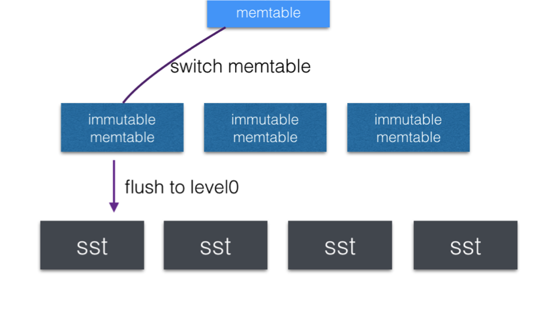

#1.MemTable 切换



memtable 发生切换的条件有
* memtable内存超过write_buffer_size会切换
* WAL日志满，WAL日志超过rocksdb_max_total_wal_size，会从所有的colomn family中找出含有最老日志(the earliest log containing a prepared section)的memtable进行切换Buffer满，全局的write buffer超过rocksdb_db_write_buffer_size时，会从所有的colomn family中找出最先创建的memtable进行切换
* flush memtable前

```cpp
memtable 切换实现
 NewWritableFile //创建日志文件
 ConstructNewMemtable //创建memtable
 cfd->imm()->Add(cfd->mem(), &context->memtables_to_free_); //设置immutable
 cfd->SetMemtable(new_mem); //设置新的memtable

```

#2.MemTable Flush


触发flush的条件有
* WAL日志满，WAL日志超过rocksdb_max_total_wal_size，会从所有的colomn family中找出含有最老日志的column family进行flush
* Buffer满，全局的write buffer超过rocksdb_db_write_buffer_size时，会从所有的colomn family中找出最先创建的memtable的column family进行flush
* 手动设置参数force_flush_memtable_now/rocksdb_force_flush_memtable_and_lzero_now时
* CompactRange时
* 创建checkpoint时
* shutdown时avoid_flush_during_shutdown=0 flush all

#3. 切换到immutable Memtable
在Rocksdb中，Memtable 和 Immutable memtable都位于内存, 唯一的区别是Memtable可读可写，而Immutable memtable是只读的，不允许写入。
在内存中，DBImpl-> VersionSet-> ColumnFamilySet-> ColumnFamilyData 内有两个成员： MemTable* mem和 MemTableList imm，分别指向Memtable和Immutable memtable队列。

以下几个情况会出现切换：

* memtable内存超过write_buffer_size
* WAL日志满，WAL日志超过rocksdb_max_total_wal_size，会从所有的colomn family中找出含有最老日志(the earliest log containing a prepared section)的memtable进行切换+ Buffer满，全局的write buffer超过rocksdb_db_write_buffer_size时，会从所有的colomn family中找出最先创建的memtable进行切换
* flush memtable前
下面简单梳理memtable切换的实现（DBImpl::SwitchMemtable）

* NewWritableFile //创建日志文件
* 修改参数使后台可以在immutable过多的时候启动 flush
* ConstructNewMemtable //创建memtable
* cfd->imm()->Add(cfd->mem(), &context->memtablesto_free); //设置immutable
* new_mem->Ref(); //增加引用
* cfd->SetMemtable(new_mem); //设置新的memtable
