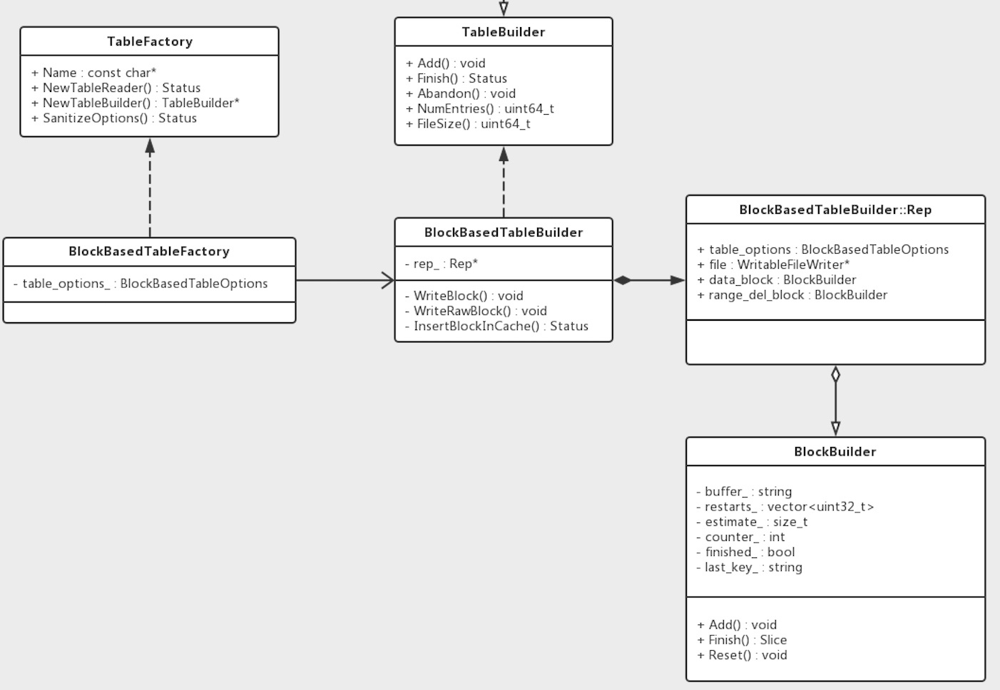
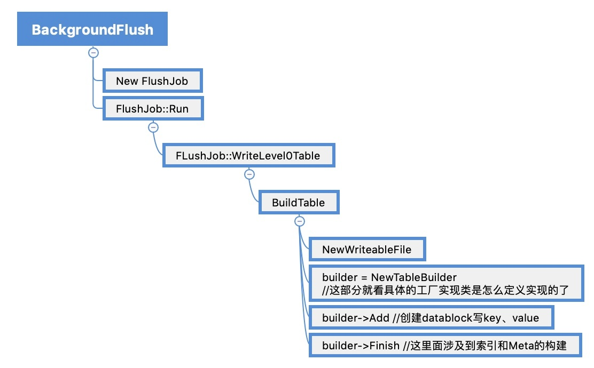
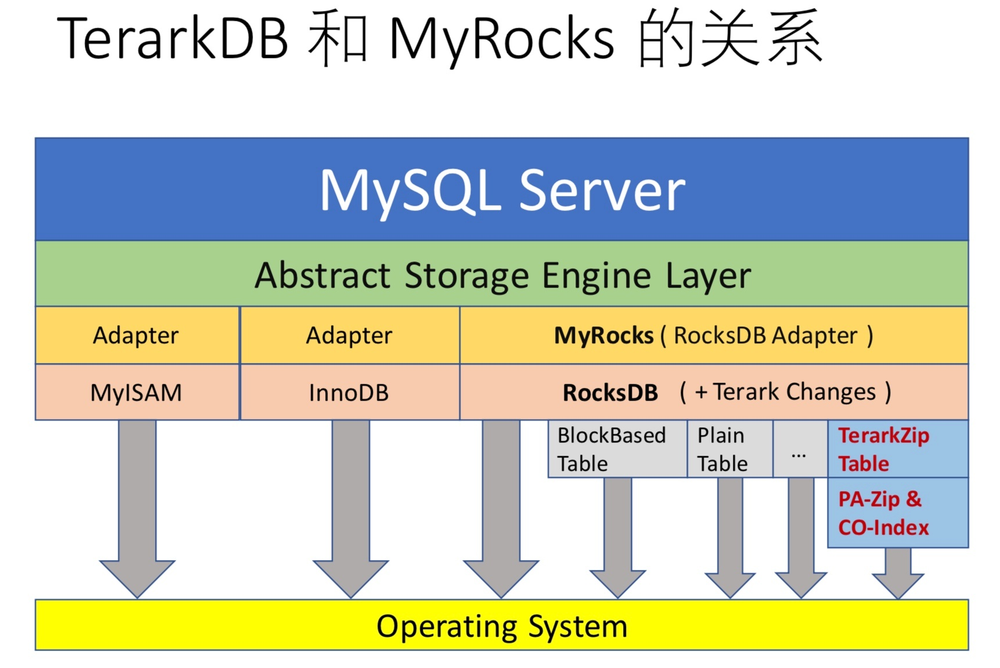
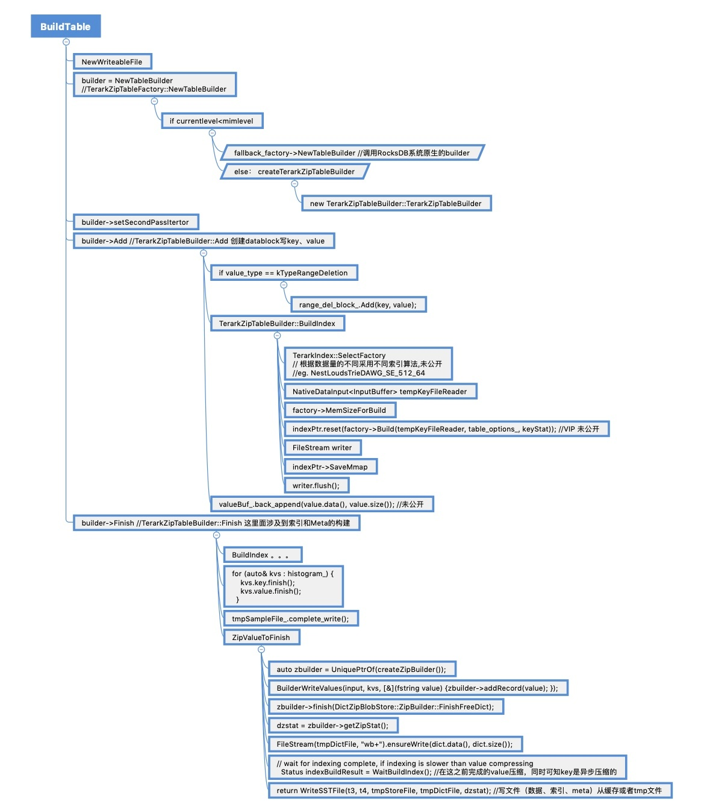
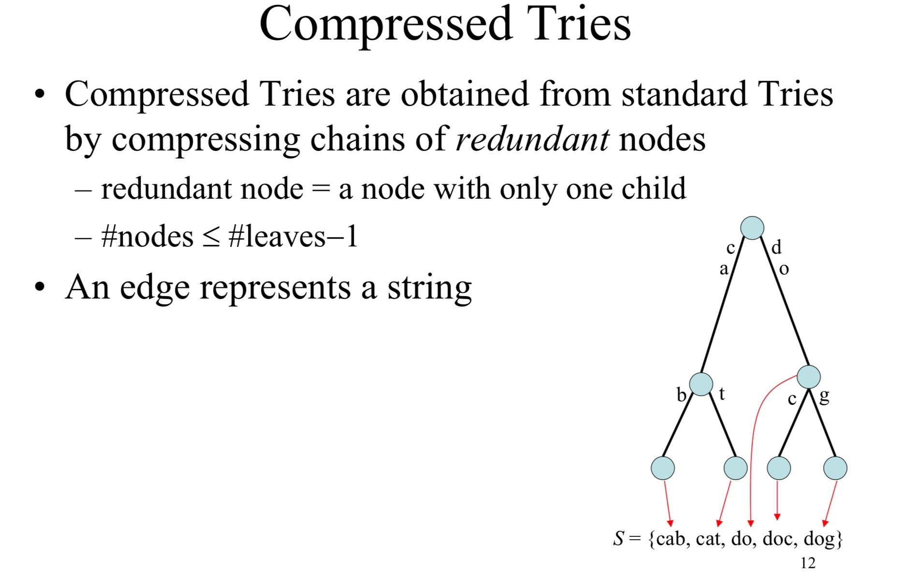
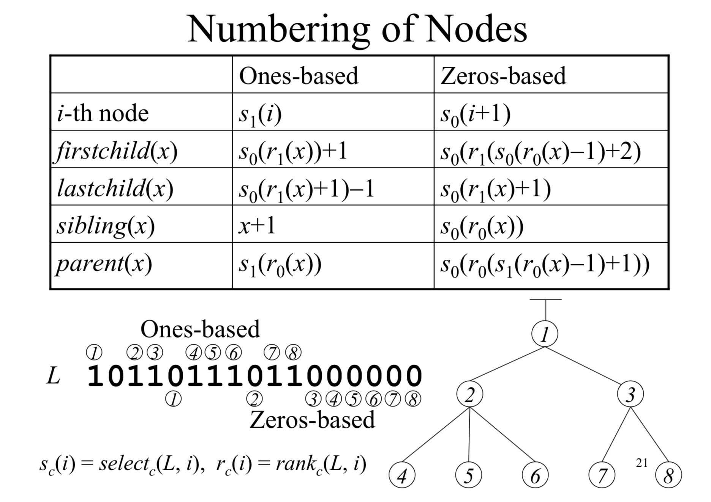
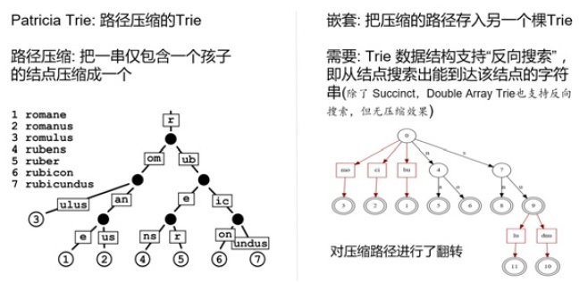

# [RocksDB 原理介绍：RockDB/Terark SST读写与压缩技术]


### RockDB/Terark SST读写与压缩技术

参考资料：  
[https://github.com/facebook/rocksdb/wiki/Rocksdb-BlockBasedTable-Format](https://github.com/facebook/rocksdb/wiki/Rocksdb-BlockBasedTable-Format) 官方wiki  
[https://www.jianshu.com/p/9b5ade5212ab](https://www.jianshu.com/p/9b5ade5212ab) 周肃  
[https://zhuanlan.zhihu.com/p/26204236](https://zhuanlan.zhihu.com/p/26204236) terarkdb  
[https://blog.csdn.net/heyc861221/article/details/80129903](https://blog.csdn.net/heyc861221/article/details/80129903) 何永灿CSDN  
[https://www.jianshu.com/p/cf5aed36b22d](https://www.jianshu.com/p/cf5aed36b22d) Glitter试做一号机

## 一、RocksDB BlockBasedTable 基本结构与压缩技术

### 1.1 基本结构

BlockBasedTable对应文件基本结构：

```plain
<beginning_of_file>
[data block 1]
[data block 2]
...
[data block N]
[meta block 1: filter block] (see section: "filter" Meta Block)
[meta block 2: stats block] (see section: "properties" Meta Block)
[meta block 3: compression dictionary block] (see section: "compression dictionary" Meta Block)
[meta block 4: range deletion block] (see section: "range deletion" Meta Block)
...
[meta block K: future extended block] (we may add more meta blocks in the future)
[metaindex block]
[index block]
[Footer] (fixed size; starts at file_size - sizeof(Footer))
<end_of_file>
```

1.  SST文件的开头是key/value对按序排列, 分配在连续的block中。默认的block大小为4k
2.  在data block后面是一些meta block
3.  index block记录了每个data block的索引。它的key值大于或等于被索引的block的最后一个key, 小于下一个data block的第一个key；value是data block对应的BlockHandle
4.  文件的末尾是一个定长footer

BlockHandles（内部句柄）：

```plain
offset: varint64
size: varint64
```

footer：

```plain
metaindex_handle: char[p]; // Block handle for metaindex
index_handle: char[q]; // Block handle for index
padding: char[40-p-q]; // zeroed bytes to make fixed length
// (40==2*BlockHandle::kMaxEncodedLength)
magic: fixed64; // 0x88e241b785f4cff7 (little-endian)
```

Meta Block包括：

1.  Filter信息 （Full filter、Partitioned Filter、Block-based filter）
2.  Properties （文件总大小、索引大小等）
3.  压缩字典 支持`kZlibCompression`, `kLZ4Compression`, `kLZ4HCCompression`, and `kZSTDNotFinalCompression`。字典的生成发生在 compact 阶段，默认只有copact到最后一层时才会用到。
4.  范围删除信息（他们只有到最终层level时才会被彻底合并吸收，否则将作为一个元素正常参与到flush和compact）

压缩：

1.  BlockBasedTable 因为key是连续的，所以采用了前缀压缩技术。
2.  同时对每个block可采用多种压缩技术，同一个实例中的不同level可以采用不同的配置。  
      
    

> For reference, several fast compression algorithms were tested and compared on a server running Linux Debian (Linux version 4.14.0-3-amd64), with a Core i7-6700K CPU @ 4.0GHz, using lzbench, an open-source in-memory benchmark by @inikep compiled with gcc 7.3.0, on the Silesia compression corpus.

### 1.2 读写对象

读写操作时，sst的操作对象：



1.  `TableFactory`  
    工厂类接口, 用来创建指定的TableReader和TableBuilder对象.
2.  `BlockBasedTableFactory`  
    rocksdb默认sst，可以在DB::Open(Options…）中修改其他存储结构。创建BlockBasedTableReader和BlockBasedTableBuilder.
3.  `TableBuilder`  
    可以认为, 一个Table就是一个SST文件, 只不过Table并不会把整个SST文件的内容持有, 而是当写满一个block, 就会flush到SST文件中. `TableBuilder`就定义了构建一个Table(SST File)的结构, 主要是Add接口, 接收调用者传进来的kv. Finish接口在数据写完之后, 将后续的meta block, index block等写入在data block后面.
4.  `BlockBasedTableBuilder`  
    实现了TableBuilder接口. 并定义了如何写下block的方法, 同时实现了将block插入到压缩cache中的私有方法.
5.  `BlockBuilder`  
    用来构造Block的对象, 可复用. 当一个block构造完成, flush到sst文件中, 就调用Reset方法, 清空buffer和成员变量, 继续构造下一个Block.

## 二、RocksDB SST 读写实现

### 2.1 SST 写操作

sst是基于文件级的操作，由TableBuilder等对象完成。单词的put写入并不一定会激发sst写文件。真正的调用来自backgroud flush 和backgroud compact（recover和repair的时候也会）。即将immutable memtable刷到L0层sst，以及sst文件的compact操作，会产生新的sst，触发sst写操作。  



### 2.2 SST 读操作

sst读操作在get环节被触发（实际上在compact环节也会）  
  
上图中先从内存读，然后通过cache读sst文件  
  
上图讲的是如何选择要读的sst文件，之后会进入单个具体的sst  


### 2.3 具体接口实现

通过对TableFactory、TableBuilder的具体工厂类实现，我们可以实现不同的sst文件读写操作。  
下面以BlockBasedTable::Add为例进行介绍。  
如类图所示，BlockBasedTableBuilder继承了TableBuilder接口，对外提供了Add、Finish、Abandon等接口，并持有一个Rep内部类，包装了一些选项，目标文件指针，和另外一个主要的结构BlockBuilder。

BlockBasedTableBuilder的Add方法实现：

1.  判断key的类型，有值类型和范围删除两种
2.  判断当前的key是否比上一个key大，保证有序
3.  判断是否需要flush当前的block到文件中，还需标记索引信息并清空data block
4.  将kv插入到data block中  
    部分实现代码如下：

```plain
void BlockBasedTableBuilder::Add(const Slice& key, const Slice& value) {
 Rep* r = rep_;
 ValueType value_type = ExtractValueType(key);
 if (IsValueType(value_type)) {
 ...
 if (r->props.num_entries > 0) {
 assert(r->internal_comparator.Compare(key, Slice(r->last_key)) > 0);
 }
 ...
 auto should_flush = r->flush_block_policy->Update(key, value);
 if (should_flush) {
 assert(!r->data_block.empty());
 Flush();
 if (ok()) {
 r->index_builder->AddIndexEntry(&r->last_key, &key, r->pending_handle);
 }
 ...
 r->last_key.assign(key.data(), key.size());
 r->data_block.Add(key, value);
 r->props.num_entries++;
 r->props.raw_key_size += key.size();
 ...
```

r->data\_block 即是BlockBuilder::Add。这里值得注意的是key的前缀压缩技术。

1.  前缀压缩：BlockBuilder使用前缀压缩来保存数据，以节省空间。
2.  restart point：并不是所有的kv都使用前缀压缩，而是有一个分界点，每当使用前缀压缩保存了K个key，下一个kv就不适用前缀压缩，而是保存整个key，它的offset就是一个restart point。restart point保存在一个数组中，写在block的尾部，用来做二分查找。
3.  value的保存紧跟在对应的key的后面。

```plain
| shared_bytes (varint32) | unshared_bytes(varint32) | value_length(varint32) | key_delta(unshared_bytes) 差异部分key | value(char[value_length]) |
... // n个上面的结构
| restarts(uint32[num_restarts]) | num_restarts(uint32) | // block尾部记录了restart点的数量和一个偏移数组，用来找到各个重启点
// 当shared_bytes = 0 时，代表一个restart point。
```

BlockBuilder持有一个成员last_key_，保存上一个Add的key，用来与当前的key计算相同的前缀长度。  
BlockBuilder的Add逻辑如下:

1.  判断是否需要restart point
2.  如果不需要restart point，将当前插入的key与前一个key比较前缀(difference\_offset)，得到可以压缩的前缀长度。
3.  得到所有需要的数据后，按照上面介绍的一个entry的格式，append到buffer中。
4.  当需要flush block时，调用Flush方法，Flush方法调用了WriteBlock方法。WriteBlock会调用BlockBuilder::Finish，将restart points append到buffer\_中。
5.  将block写文件前会根据设置调用压缩(CompressBlock)。
6.  更新索引项

在所有data block写完之后, 会在BlockBasedTableBuilder的Finish方法中,将后续的meta blocks, meta index block, index block和footer等写入到文件中.

## 三、TerarkDB 概述

Terark公司提出了“可检索压缩（Searchable Compression）”的概念，其核心也是直接在压缩的数据上执行搜索和访问，但数据模型本身就是KeyValue模型。

*   摒弃传统数据库的块压缩技术，采用全局压缩；
*   对Key和Value使用不同的全局压缩技术；
*   对Key使用有搜索功能的全局压缩技术COIndex；
*   对Value使用可定点访问的全局压缩技术PA-Zip  
    
*   

### 优势

*   压缩率更高
    *   磁盘文件更小
    *   数据规模越大，压缩率越高
*   内存用量更少
    *   只需 mmap 压缩的文件，无双缓存问题（读的时候）
*   随机访问更快
    *   直接访问压缩的数据
    *   只访问需要的数据，没有无效解压
    *   顺应硬件发展趋势:随机少量读，高 IOPS

### 劣势

*   速度慢
    
    *   算法复杂，计算量大
    *   算法的内存访问局部性较差，CPU Cache miss 较高。
*   内存用量大
    *   全局压缩，需要更多工作内存
*   顺序读慢
    
    *   顺序读慢在 CO-Index，PA-Zip 的顺序读是很快的。具体来说，Nested Succinct Trie，它的数据高度压缩，结构复杂，内存访问的局部性差
    *   传统存储引擎的块压缩，非常适合顺序读
*   建议:
    
    *   限制内存 & 优化调度
    *   限制压缩算法的并发线程数、内存上限……

## 四、TerarkDB 读写适配

TerarkDB有基于RocksDB的实现版本，基于早期RocksDB版本，修改sst逻辑，并mergeRockDB官方修改。  
TerarkDB对RocksDB的修改可以分为三部分。

1.  sst修改，这部分也可以看做读写操作对于底层压缩的适配部分（table工厂类的实现）。
2.  压缩核心算法，包括key（CO-Index）压缩和value（PA-Zip）压缩
3.  为了实现压缩算法对RocksDB本身也进行了一定改造和参数配置。创建支持PA-Zip的sst时，TerarkDB需要对输入扫描两遍，第一遍计算 Value 的各种统计特征，并且收集全局字典，第二遍执行压缩。详情阅读 [TerarkDB SST 的创建过程](https://github.com/Terark/terarkdb/wiki/TerarkDB-SST-%E7%9A%84%E5%88%9B%E5%BB%BA%E8%BF%87%E7%A8%8B)。 另外TerarkDB默认使用UniversalCompact。

TerarkDB 仅仅开源了SST 读写的适配部分，即继承自 TableFactory TableBuilder 的子类实现代码。



另外TerarkDB也有配合RockDB嵌入到MySQL的版本。上图可也比较清晰的看到其模块结构。

### 4.1 写适配

前面介绍过，写的过程主要调用的sst接口是BuildTable（内部调用NewTableBuilder创建TableBiulder）和TableBiulder::Add、TableBiulder::Finish操作。

  


### 4.2 读适配

读操作暴露的接口变化更少。可以参考前文RocksDB SST的代码调用。  
主要是在TableCache::Get中GetTableReader调用TerarkTableFactory::NewTableReader创建reader，然后调用TerarkTable::Open打开sst文件（其中包括索引加载NestLoudsTrieBuildCache等操作）。  
以及读出kv时，使用TerarkTableReader调用TerarkTableSubReader::Get获取数据，其中由TerarkIndex::Find去搜索之前加在的索引然后直接拿到解压后的数据。

## 五、TerarkDB 压缩技术

### 5.1 对Key的压缩：CO-Index

对比传统实现索引的数据结构，TerarkDB宣城，其Nested Succinct Trie的空间占用是原有的十几分之一甚至几十分之一。而在保持该压缩率的同时，该算法还支持丰富的搜索功能：精确搜索；范围搜索；顺序遍历；前缀搜索；正则表达式搜索。根据一有资料可知，其Nested Succinct Trie至少涉及三项技术。  
（1）Compressed Tries  
  
（2）Succinct Sturcture

*   一个树说他是succinct，则表示这个树的空间占用接近信息论中的里面极限，也就是要表示一个集合中所有的item的最小bit数。
    
*   一个大小为n的集合至少需要log2(n)的bit数来编码（好像学过）
    
*   一个度为k的树表示每个node最多可以有k个子节点
    
*   ordinal tree表示每个节点可以有任意数量的有序子节点的树
    
*   LOUDS是编码一个ordinal-tree的方法，LOUDS通过宽度优先遍历所有节点并通过一个一元码来编码每个节点的度
    
*   通过rank和select原语来访问一个LOUDS编码的树，给定一个bit序列，rank1(i)统计到i为止的1的个数（rank0(i)统计0），select1(i)返回第i个1的位置（这个过程是常数级的时间复杂度）



（3）Nested Sturcture  
  
路径压缩后再做一次trie

### 5.2 对value的压缩： PA-Zip

PA-Zip: Point Accessible Zip，存的是value。：每条数据关联一个 ID，数据压缩好之后，就可以用相应的 ID 访问那条数据。可以看做是一个抽象的 array，核心功能是把 ID 作为抽象数组的下标，去访问该抽象数组的元素。  
PA-Zip 对整个数据库中的所有 Value （KeyValue 数据库中所有 Value 的集合）进行全局压缩，而不是按 block/page 进行压缩。  
这这种压缩是 Terark 专门针对数据库的需求（KeyValue 模型），专门精心设计的一个压缩算法，用来彻底解决传统数据库压缩的问题：  
该算法综合使用了很多种技术，非常复杂，并且涉及到 Terark 的一些专利和保密算法。  
Key 以全局压缩的形式保存在 IndexCO-Index 中，Value 以全局压缩的形式保存在 PA-Zip中。搜索一个 kKey，会得到一个内部 ID，根据这个内部 ID，去全局压缩的 Value 集合 PA-Zip 中定点访问该 ID 对应的 Value，整个过程中只触碰访问需要的数据，不需要触碰其它数据。

RocksDB中的BlockBasedTable就是一个块压缩的SSTable，使用块压缩，索引只定位到块。创建BlockBasedTable时，Key Value被逐条填入buffer，当buffer尺寸达到预定大小（块尺寸，当然，一般buffer尺寸不会精确地刚好等于预设的块尺寸），就将buffer压缩并写入BlockBasedTable文件，并记录文件偏移和buffer中的第一个Key（创建index要用），如果单条数据太大，比预设的块尺寸还大，这条数据就单独占一个块（单条数据不管多大也不会分割成多个块）。

总的来说，对比两种方案。rocksdb 压缩的单位是 Block，比 PA-Zip 的压缩单位(SST)要小，rocksdb 解压的单位也是 Block，比 PA-Zip 解压单位(Value)要大。PA-Zip 宣称采用全局压缩，rocksdb 是传统的分块+通用流式压缩(gzip,snappy,zstd…)。 PA-Zip 讲取得更好的压缩率，同时解压的时候也更省内存。

