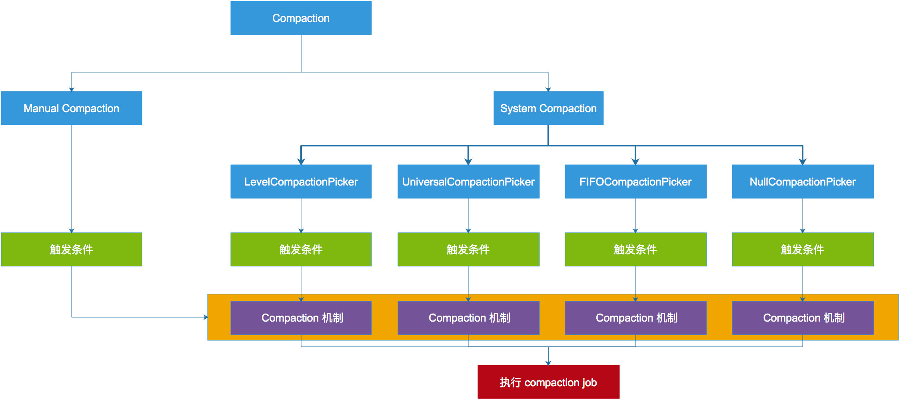
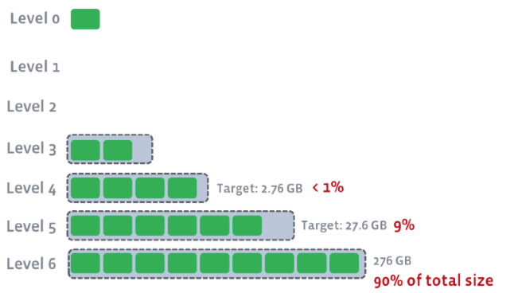
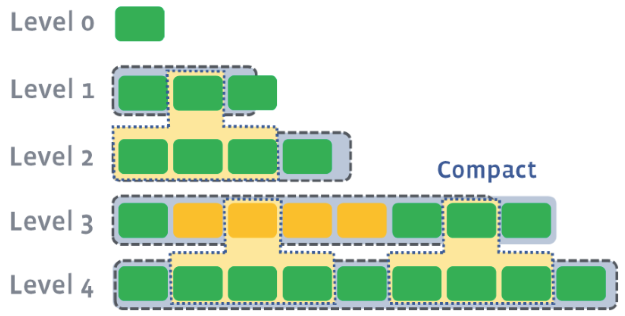
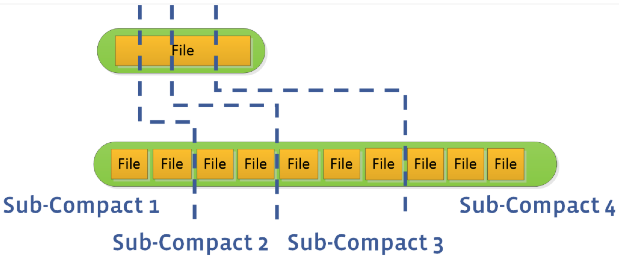
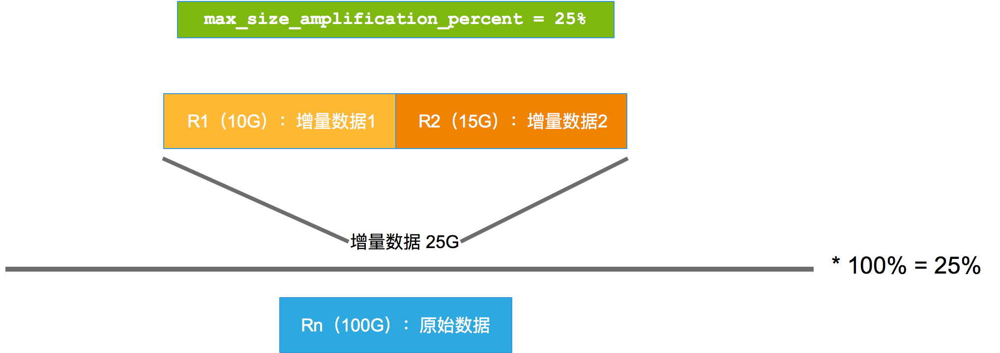
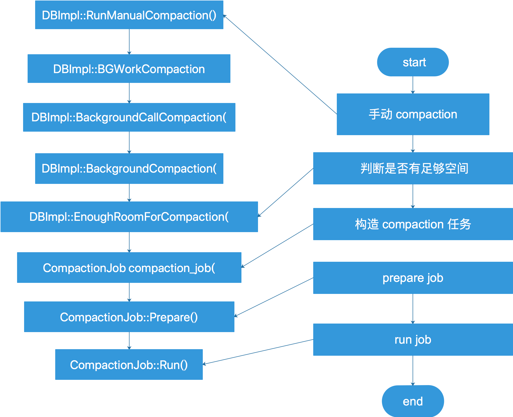

# [RocksDB 原理介绍：WAL+CF+Compact]
  

# 0 参考资料

[https://github.com/facebook/rocksdb/wiki/Write-Ahead-Log](https://github.com/facebook/rocksdb/wiki/Write-Ahead-Log)

[https://github.com/facebook/rocksdb/wiki/Compaction](https://github.com/facebook/rocksdb/wiki/Compaction)

[https://github.com/facebook/rocksdb/wiki/Leveled-Compaction](https://github.com/facebook/rocksdb/wiki/Leveled-Compaction)

[https://github.com/facebook/rocksdb/wiki/Universal-Compaction](https://github.com/facebook/rocksdb/wiki/Universal-Compaction)

[https://github.com/facebook/rocksdb/wiki/Universal-Style-Compaction-Example](https://github.com/facebook/rocksdb/wiki/Universal-Style-Compaction-Example)

[https://github.com/facebook/rocksdb/wiki/Proposal:-Unifying-Level-and-Universal-Compactions](https://github.com/facebook/rocksdb/wiki/Proposal:-Unifying-Level-and-Universal-Compactions)

[https://github.com/facebook/rocksdb/wiki/Column-Families](https://github.com/facebook/rocksdb/wiki/Column-Families)

* * *

# 1 WAL

WAL文件由一堆变长的record组成，而每个record是由kBlockSize(32k)来分组，比如某一个record大于kBlockSize的话，他就会被切分为多个record（通过type来判断)。

```java
     +-----+-----------+--+----+----------+------+-- ... ----+
File | r0  |      r1   |P | r2 |    r3    |  r4  |           |
     +-----+-----------+--+----+----------+------+-- ... ----+
     |<--- kBlockSize --->|<-- kBlockSize ------>|
 rn = variable size records
 P = Padding
```

【**record的格式**】如下

```java
       +---------+-----------+-----------+--- ... ---+
Record |CRC (4B) | Size (2B) | Type (1B) | Payload   |
       +---------+-----------+-----------+--- ... ---+
CRC = 32bit hash computed over the payload using CRC
Size = Length of the payload data
Type = Type of record (kZeroType, kFullType, kFirstType, kLastType, kMiddleType )
       The type is used to group a bunch of records together to represent blocks that are larger than kBlockSize
Payload = Byte stream as long as specified by the payload size
```

* * *

# 2 Column Family

Rocksdb中引入了ColumnFamily（列族, 以下简称CF）的概念，所谓列族也就是一系列kv组成的数据集。逻辑上管理一组 k-v 对。

在 MyRocks 中一个表可以是一个单独的CF，也可以多个表共用一个CF。

每个 CF有自己的 Memtable， SST文件，所有CF 共享 WAL、Current、Manifest 文件。

一个 CF 是否有且只有一个 action memtable，一个 CF 可以同时有多个 Immutable memtable。


CF 是对数据的逻辑划分，其实也是物理划分，因为不同 CF 不共享 memtable / Immutable memtable / SST。

引入 CF 的概念，能够独立的配置、删除 CF，CF 有引用计数，引用计数不为0，则 CF 不会被真正的删除。

同时，多个 CF 共用一个 WAL 配合 WriteBatch，保证了批量写入操作的原子性，极大的简化了对事务的处理，无需使用 2PC，就能实现跨 CF 的分布式事务。

* * *

# 3 Flush

Minor Compaction：将内存中Immutable Memtable转储到磁盘SSTable。

Major Compaction：磁盘上的SSTable文件从低层向高层转储。


执行 flush 操作的线程数可配置（rocksdb\_max\_background\_flushes）。

入口函数为：FlushMemTable()。

level 0 存在冗余数据，level 1 ~ level n 不存在数据冗余。

## 3.1 flush 触发机制

Immutable memtable 的数量是否超过了 min\_write\_buffer\_number\_to\_merge。

【构造 flush 任务】


【任务执行流程】


流程如下：

1.  遍历 immutable-list，如果没有其它线程正在执行 flush，则将 flush 任务加入队列
2.  通过迭代器逐一扫描Immutable memtable 中的 key-value，将 key-value 写入到 data-block 
3.  如果 data block 大小已经超过 block\_size （比如16k），或者是最后一对 key-value，则触发一次 block-flush
4.  根据压缩算法对 block 进行压缩，并生成对应的 index block 记录（begin\_key, last\_key, offset）
5.  至此若干个 block 已经写入文件，并为每个 block 生成了 index-block 记录
6.  写入 index-block，meta block，metaindex block 以及 footer 信息到文件尾
7.  将 SST 文件的元信息写入 manifest 文件

flush 的过程是将 immutable table 写入 level 0，level 0 各个 SST 内部没有冗余数据，但 SST 之间会有 Key 的交叠。

## 3.2 flush 的调用点

调用 FlushMemtable 的原因如下

```java
enum class FlushReason : int {
  kOthers = 0x00,
  kGetLiveFiles = 0x01,
  kShutDown = 0x02,
  kExternalFileIngestion = 0x03,
  kManualCompaction = 0x04,
  kWriteBufferManager = 0x05,
  kWriteBufferFull = 0x06,
  kTest = 0x07,
  kDeleteFiles = 0x08,
  kAutoCompaction = 0x09,
  kManualFlush = 0x0a,
};
```

【checkpoint】

checkpoint 时会调用 flush，但是条件无法达成


# 4 Compaction 综述

也称作 Major Compaction，线程数可配置（rocksdb\_max\_background\_compactions）。

入口函数为 BackgroundCompaction。



# 5 Level Compaciton

【compaction 流程】


## 5.1 触发条件

compaction触发机制是通过判断 各个 level

*   Total File Size
*   SST 个数

是否超过配置，来决定是否发生 compaction。

【level 0 触发条件】

*   SST 文件个数达到参数 level0\_file\_num\_compaction\_trigger
*   level 0 的 file size 超过 max\_bytes\_for\_level\_base

【level 1~n 触发条件】

*   level n 当前的 total file size 是否 大于 max\_bytes\_for\_level\_base

_**注：max\_bytes\_for\_level\_base 又称作 Target Size。**_

## 5.2 Compaction 机制

### 5.2.1 触发顺序

当多个 level 同时达到触发条件时，需要确定 compaction 的先后顺序。

因此，各个 level 需要计算出一个值 score，score 大的值先执行 compaction。

RocksDB 中通过一个任务队列维护compaction任务，score 大的 level 优先加入任务队列等待处理。

score 的计算方式如下：

【level 0】： Snum = total file num / level0\_file\_num\_compaction\_trigger

                      Ssize = total file size / max\_bytes\_for\_level\_base

                      level 0 score = max(Snum, Sszie)

同时，level 0 的 compaction 操作会影响写入。


为了不影响写入，直接将 level 0 的 score 调高，优先 compaction。

具体调整方式如下：

<table class="confluenceTable"><colgroup><col><col><col><col></colgroup><tbody><tr><td style="text-align: center;" class="confluenceTd"><div class="table-cell-line"><strong><span style="color: rgb(0,0,0);">Param</span></strong></div></td><td style="text-align: center;" class="confluenceTd"><div class="table-cell-line"><strong><span style="color: rgb(0,0,0);">Value</span></strong></div></td><td style="text-align: center;" class="confluenceTd"><div class="table-cell-line"><strong><span style="color: rgb(0,0,0);">Description</span></strong></div></td><td style="text-align: center;" class="confluenceTd"><div class="table-cell-line"><strong><span style="color: rgb(0,0,0);">Score</span></strong></div></td></tr><tr><td class="confluenceTd"><div class="table-cell-line"><span style="color: rgb(0,0,0);">level0_</span><span style="color: rgb(0,0,0);">file_</span><span style="color: rgb(0,0,0);">num_</span><span style="color: rgb(0,0,0);">compaction_</span><span style="color: rgb(0,0,0);">trigger</span></div></td><td class="confluenceTd"><div class="table-cell-line"><span style="color: rgb(0,0,0);">4</span></div></td><td class="confluenceTd"><div class="table-cell-line"><span style="color: rgb(0,0,0);">num 为 4 时，达到 compact 条件</span></div></td><td class="confluenceTd"><div class="table-cell-line"><span style="color: rgb(0,0,0);">4 &lt;= num &lt; 20 时 Score = num / 4</span></div></td></tr><tr><td class="confluenceTd"><div class="table-cell-line"><span style="color: rgb(0,0,0);">level0_</span><span style="color: rgb(0,0,0);">slow_down_</span><span style="color: rgb(0,0,0);">writes_trigger</span></div></td><td class="confluenceTd"><div class="table-cell-line"><span style="color: rgb(0,0,0);">20</span></div></td><td class="confluenceTd"><div class="table-cell-line"><span style="color: rgb(0,0,0);">num 为 20 时，RocksDB 会减慢写入速度</span></div></td><td class="confluenceTd"><div class="table-cell-line"><span style="color: rgb(0,0,0);">20 &lt;= num &amp;&amp; num &lt; 24 时 Score = 10000</span></div></td></tr><tr><td class="confluenceTd"><div class="table-cell-line"><span style="color: rgb(0,0,0);">level0_</span><span style="color: rgb(0,0,0);">stop_</span><span style="color: rgb(0,0,0);">writes_trigger</span></div></td><td class="confluenceTd"><div class="table-cell-line"><span style="color: rgb(0,0,0);">24</span></div></td><td class="confluenceTd"><div class="table-cell-line"><span style="color: rgb(0,0,0);">num 为 24 时，RocksDB 停止写入文件，尽快对 L0 进行 compact</span></div></td><td class="confluenceTd"><div class="table-cell-line"><span style="color: rgb(0,0,0);">24 &lt;= num 时 Score = 1000000</span></div></td></tr></tbody></table>

【level 1~】：score = Level 1 ~ n file size / max\_bytes\_for\_level\_base

### 5.2.2 动态调整触发条件

每层的 Target Size 都不同，通过 level\_compaction\_dynamic\_level\_bytes （true / false） 配置 Target Size  的动态调整。

【**level\_compaction\_dynamic\_level\_bytes 为 false**】关闭动态调整，target size 计算规则如下：

*   【**level 0 的 target size**】：max\_bytes\_for\_level\_base 的值
*   【**level n 的 target size**】：Target\_Size(Ln+1) = Target\_Size(Ln) \* max\_bytes\_for\_level\_multiplier \* max\_bytes\_for\_level\_multiplier\_additional\[n\]

*   相关参数
    *   max\_bytes\_for\_level\_multiplier：**乘法因子**
    *   max\_bytes\_for\_level\_multiplier\_additional\[n\]：****各 level 的调整参数，**默认为1******

【**例如**】：level 1 的 max\_bytes\_for\_level\_base 是 10GB，max\_bytes\_for\_level\_multiplier=10，max\_bytes\_for\_level\_multiplier\_additional\[1\]=1。

则 level 1，2，3，4 的 max\_bytes\_for\_level\_base 分别为：10GB，100GB，1000GB，10000GB

* * *

【**level\_compaction\_dynamic\_level\_bytes 为 true**】动态调整，target size 计算规则如下：

设：有 n 个 level，则 max\_bytes\_for\_level\_base 为最后一个 level n 的数据量阈值

*   level n-1 = level n / max\_bytes\_for\_level\_multiplier。

【**例如**】：n=6，level n size = 276GB，max\_bytes\_for\_level\_multiplier = 10，则 level 1 ~ level 6 的 target size 为：

<table class="confluenceTable"><colgroup><col><col><col><col><col><col><col></colgroup><tbody><tr><td class="confluenceTd">&nbsp;</td><td class="confluenceTd"><div class="table-cell-line"><strong><span style="color: rgb(0,0,0);">level 1</span></strong></div></td><td class="confluenceTd"><div class="table-cell-line"><strong><span style="color: rgb(0,0,0);">level 2</span></strong></div></td><td class="confluenceTd"><div class="table-cell-line"><strong><span style="color: rgb(0,0,0);">level 3</span></strong></div></td><td class="confluenceTd"><div class="table-cell-line"><strong><span style="color: rgb(0,0,0);">level 4</span></strong></div></td><td class="confluenceTd"><div class="table-cell-line"><strong><span style="color: rgb(0,0,0);">level 5</span></strong></div></td><td class="confluenceTd"><div class="table-cell-line"><strong><span style="color: rgb(0,0,0);">level 6</span></strong></div></td></tr><tr><td class="confluenceTd"><div class="table-cell-line"><strong><span style="color: rgb(0,0,0);">Target size</span></strong></div></td><td class="confluenceTd"><div class="table-cell-line"><span style="color: rgb(0,0,0);">0</span></div></td><td class="confluenceTd"><div class="table-cell-line"><span style="color: rgb(0,0,0);">0</span></div></td><td class="confluenceTd"><div class="table-cell-line"><span style="color: rgb(0,0,0);">0.276 GB</span></div></td><td class="confluenceTd"><div class="table-cell-line"><span style="color: rgb(0,0,0);">2.76 GB</span></div></td><td class="confluenceTd"><div class="table-cell-line"><span style="color: rgb(0,0,0);">27.6 GB</span></div></td><td class="confluenceTd"><div class="table-cell-line"><span style="color: rgb(0,0,0);">276 GB</span></div></td></tr></tbody></table>



动态调整的目的是保证各个level 保存的数据量为总体数据量的百分比固定。

如图，level 1、2 不能保存任何数据，因此，level 0 在进行 compaction 时，会直接跳过 level 1、2。

## 5.3 并发执行

*   多个并发任务不会有重叠的key



*   为提高并发，rocksDB 通过 max\_subcompactions 参数，能够将一个文件拆分为多个子任务，并发执行，类似于表级并行复制。



## 5.4 配置项

*   options.max\_bytes\_for\_level\_base: 每层存放 SST 的数据量限制
    
*   options.level\_compaction\_dynamic\_level\_bytes: 动态每层存放 SST 的数据量限制（level SST size limitation）
    
*   options.max\_bytes\_for\_level\_multiplier and options.max\_bytes\_for\_level\_multiplier\_additional: 动态调整 level size limitation 时的系数
    
*   options.expanded\_compaction\_factor: 待确认
    
*   options.source\_compaction\_factor: 待确认
    
*   options.max\_grandparent\_overlap\_factor: only for level-based compactions 待确认
    
*   options.soft\_rate\_limit and options.hard\_rate\_limit: deprecated  待确认
    
*   options.hard\_pending\_compaction\_bytes\_limit: only used for level-based compaction 待确认
    
*   options.compaction\_pri: only supported in level-based compaction  待确认
    

# 6 Universal Compaction

*   目的是降低写放大，适用于：**写负载高的系统**
*   降低写放大的策略：控制后台 compaction 操作


*   一个 SST 被称为一个 sorted run
*   多个 sorted run 按照更新时间排序，构成 sorted runs
*   sorted runs 之间的 时间范围不重叠
*   **Level 0：**一个 sorted run 构成一个 sorted runs
*   **Level 1~n**：同 level 的所有 sorted run（SST）构成一个 sorted runs

## 6.1 触发条件

```plain
Precondition: n >= options.level0_file_num_compaction_trigger
```

*   n：CF 的 sorted runs 个数
*   options.level0\_file\_num\_compaction\_trigger：触发 compaction 的阈值
    

```plain
options.level0_file_num_compaction_trigger = 5
 
Level 0: File0_0, File0_1, File0_2
Level 1: (empty)
Level 2: (empty)
Level 3: (empty)
Level 4: File4_0, File4_1, File4_2, File4_3
Level 5: File5_0, File5_1, File5_2, File5_3, File5_4, File5_5, File5_6, File5_7
 
sorted runs 个数为 5 >= options.level0_file_num_compaction_trigger
```

*   将 sorted runs 的总数作为 Universal Compaction 的触发判断条件

## 6.2 Compaction 机制

*   由以下三个条件判断进行怎样 Compaction，三个条件同时生效。

### 6.2.1 总空间放大比

*   通过判断 CF 的 空间放大比，决定是否进行 compaction。判断条件为如下：

```plain
(size(R1) + size(R2) + ... size(Rn-1)) / size(Rn) >= options.compaction_options_universal.max_size_amplification_percent / 100
```



【适用场景】

*   数据量稳定的业务场景，即系统数据量基本稳定
    *   此时，新增的 SST 文件中的 insert 与 delete 数量基本一致
    *   compact 后，insert delete 相互抵消，系统数据量保持不变，始终为 Rn
*   在此场景下，可以通过比例来计算 空间放大

【compaction 举例】

```plain
【条件】
空间放大比例为 25%
	options.compaction_options_universal.max_size_amplification_percent = 25
触发 compaction 的 Sorted runs 个数为 1
 	options.level0_file_num_compaction_trigger = 1
 
1
1 1  =>  2      1/1=100% > 25%
1 2  =>  3      ...
1 3  =>  4      ...
1 4             1/4=25% = 25%
1 1 4  =>  6    2/4=50% > 25%
1 6
1 1 6  =>  8
1 8
1 1 8
1 1 1 8  =>  11
1 11
1 1 11
1 1 1 11  =>  14
1 14
1 1 14
1 1 1 14
1 1 1 1 14  =>  18
```

###   
6.2.2 独立数据量比

*   通过 size(Rn) / size(R1) + ... + size(Rn-1) <= size\_ratio\_trigger 判断 Rn 能否与 R1...Rn-1 构成一次 compaction
*   size\_ratio\_trigger 的计算公式如下

```plain
size_ratio_trigger = (100 + options.compaction_options_universal.size_ratio) / 100
【说明】
size_ratio 通常接近于 0，因此，size_ratio_trigger 通常接近于 1
例如：size_ratio = 1，size_ratio_trigger= (1+100)/100 = 1.01
```

【 compaction 举例】

```plain
【条件】
size_ratio: 1
	options.compaction_options_universal.size_ratio = 1
	size_ratio_trigger = 1.01
触发 compaction 的 Sorted runs 个数为 5
 	options.level0_file_num_compaction_trigger = 5
 
1 1 1 1 1  =>  5
1 5  (no compaction triggered)      sorted runs 个数不足 5 个, 不触发 compaction
1 1 5  (no compaction triggered)    ...
1 1 1 5  (no compaction triggered)  ...
1 1 1 1 5  => 4 5                   size(R2)/size(R1) = 1 < 1.01，(R1,R2) 可以进行 compaction
                                    size(R3)/size(R1)+size(R2) = 0.5 < 1.01，(R1,R2,R3) 可以进行 compaction
                                    以此类推，(R1,R2,R3,R4) 可以进行 compaction
                                    size(R5)/size(R1+R2+R3+R4) = 5/4 = 1.25 > 1.01，R5无法加入 compaction
1 4 5  (no compaction triggered)
1 1 4 5  (no compaction triggered)
1 1 1 4 5 => 3 4 5
1 3 4 5  (no compaction triggered)
1 1 3 4 5 => 2 3 4 5
1 2 3 4 5                           不符合条件，无法 compaction
1 1 2 3 4 5 => 16                   1/1 <= 1.01
                                    2/(1+1) <= 1.01
                                    3/(1+1+2) <= 1.01
                                    4/(1+1+2+3) <= 1.01
                                    5/(1+1+2+3+4) <= 1.01
                                    全部合并
1 16  (no compaction triggered)
1 1 16  (no compaction triggered)
1 1 1 16  (no compaction triggered)
1 1 1 1 16  => 4 16
1 4 16  (no compaction triggered)
1 1 4 16  (no compaction triggered)
1 1 1 4 16 => 3 4 16
1 3 4 16  (no compaction triggered)
1 1 3 4 16 => 2 3 4 16
1 2 3 4 16  (no compaction triggered)
1 1 2 3 4 16 => 11 16
```

### 6.2.3 全局 compaction

*   当“总空间放大比” 与 “独立数据量比” 均无法构造满足条件的 compaction 时，将强制选择前 n 个 runs 进行 compaction，使 sorted runs 个数小于options.level0\_file\_num\_compaction\_trigger。

## 6.3 文件布局

*   原始文件布局

```plain
Level 0: File0_0, File0_1, File0_2
Level 1: (empty)
Level 2: (empty)
Level 3: (empty)
Level 4: File4_0, File4_1, File4_2, File4_3
Level 5: File5_0, File5_1, File5_2, File5_3, File5_4, File5_5, File5_6, File5_7
```

【最下层原则】

*   ```plain
    File0_1, File0_2, Level 4 compaction，output 位于 level4
    ```
    

```plain
Level 0: File0_0
Level 1: (empty)
Level 2: (empty)
Level 3: (empty)
Level 4: File4_0', File4_1', File4_2', File4_3'
Level 5: File5_0, File5_1, File5_2, File5_3, File5_4, File5_5, File5_6, File5_7
```

  
【降级原则】

*   Level 0 的三个 sorted runs compaction，output 位于 Level3

```plain
Level 0: (empty)
Level 1: (empty)
Level 2: (empty)
Level 3: File3_0, File3_1, File3_2
Level 4: File4_0, File4_1, File4_2, File4_3
Level 5: File5_0, File5_1, File5_2, File5_3, File5_4, File5_5, File5_6, File5_7
```

【同层原则】

*   Level 0 的 File0\_0, File0\_1 compaction，output 仍然位于 Level0

```plain
Level 0: File0_0', File0_2
Level 1: (empty)
Level 2: (empty)
Level 3: (empty)
Level 4: File4_0, File4_1, File4_2, File4_3
Level 5: File5_0, File5_1, File5_2, File5_3, File5_4, File5_5, File5_6, File5_7
```

## 6.4 限制条件

*   **【导致数据量加倍】**：当需要进行全局 compaction 时，生成的数据量与原始数据相当，Rn 与 Rn' 并存，导致数据量加倍  
    
*   **【BLOCK Size 超限(4GB)】**只有一层，有可能会出现所有的 SST 合并为一个 SST，SST 越大，index block越大，可能超出4GB 的限制条件

## 6.5 配置项

*   options.compaction\_options\_universal：父配置项
*   options.level0\_file\_num\_compaction\_trigger：触发 compaction 的 sorted runs 个数，compaction 结束后，CF 中的 sorted runs 个数最大为options.level0\_file\_num\_compaction\_trigger+1
*   options.level0\_slowdown\_writes\_trigger：sorted run
*   options.level0\_stop\_writes\_trigger: if number of sorted runs exceed this value, writes will stop until compaction finishes and number of sorted runs turn under this threshold.
*   options.num\_levels: if this value is 1, all sorted runs will be stored as level 0 files. Otherwise, we will try to fill non-zero levels as much as possible. The larger num\_levels is, the less likely we will have large files on level 0.
*   options.target\_file\_size\_base: effective if options.num\_levels > 1. Files of levels other than level 0 will be cut to file size not larger than this threshold.
*   options.target\_file\_size\_multiplier: it is effective, but we don't know a way to use this option in universal compaction that makes sense. So we don't recommend you to tune it.
*   options.compaction\_options\_universal.min\_merge\_width：sorted runs 个数多于 min\_merge\_width 才执行，默认：2
*   options.compaction\_options\_universal.max\_merge\_width：限制一次 compaction 最大包含的 sorted runs 个数，默认：UINT\_MAX

# 7 FIFO Compaction

FIFO顾名思义就是先进先出，这种模式周期性地删除旧数据。最简单、开销最小的 compaction 策略。

在FIFO模式下，所有文件都在level0，当 SST 总大小超过阀值 max\_table\_files\_size，则直接删除最老的 SST 文件，而不再进行合并，因此没有写放大。

# 8 Manual Compaction

用户可以直接手动发起 compaction。

【适用场景】

1.  将数据 compaction 到 最底层，减少写放大，适用于 读负载高的业务；
2.  修改 level num，将指定范围内的数据压缩到最底层，然后将文件直接迁移到指定的 level；
3.  修改配置（例如：压缩算法、block size、bloom filter settings、索引格式）。

【使用方式】

```java
mysql> set session rocksdb_manual_compaction_threads=16;
Query OK, 0 rows affected (0.00 sec)
 
mysql> set global rocksdb_compact_cf='cf_node_pk';
Query OK, 0 rows affected (25 min 13.80 sec)
```

【注意事项】

1.  手动触发 compaction 会导致终端挂起，直至 compaction 结束
2.  多个 session 发出 compaction 请求，请求会被添加到 FIFO 队列，顺序执行
3.  MyRocks 同一时刻只能执行一个手动 campaction 请求
4.  发起 compaction 请求的终端断开连接，若请求未开始则会被取消
5.  以开始处理的 compaction 请求无法终止

【执行流程】



# 4 会议总结

1.  SwitchMemtable 的目的是什么?flush 时为什么要 SwitchMemtable?
2.  动态调整 target size 有什么意义? 静态调整与动态调整分别适用于哪种场景?可以带来很多好处，好处是啥？
3.  Universal Compaction 是否分层? 若做全局 compaction，compaction 的结果位于哪个层？
4.  FIFO 的实现策略以及使用场景是什么？
5.  Time range 是 SST 中的数据更新时间，这个时间存在哪里？是时间戳么？排序是对 matedata 进行排序！

