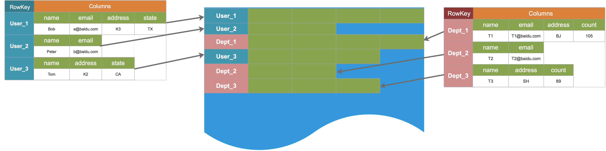
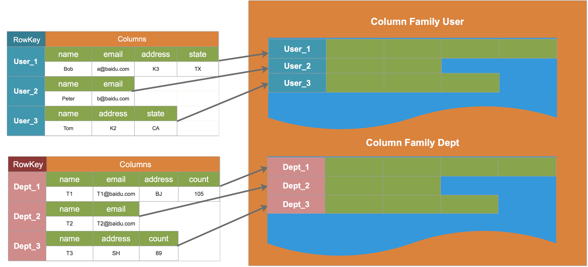
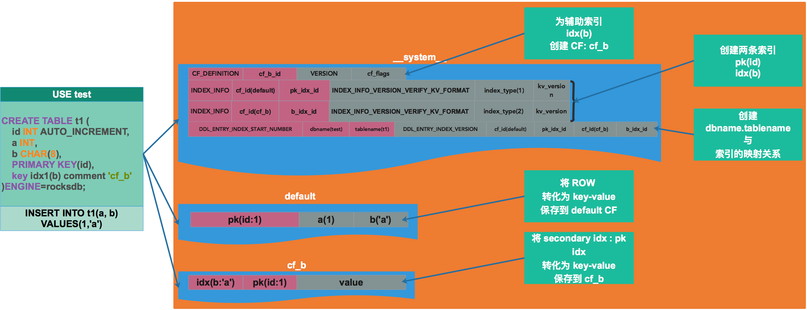

# [RocksDB 原理介绍：CF]

# 0 综述

MyRocks 是关系型数据库，数据以 schema、table 进行管理。

MyRocks ：Row → key-value

本文主要论述以下几个方面：

*   Column Family 的定义；
*   MyRocks 数据字典；
*   MyRocks 数据记录格式；

# 1 Column Family

## 1.1 CF 的由来

*   **没有 CF 时的数据组织形式**



*   **带来的问题：**
    *   将数据组织在一起——不便于管理
    *   select、update 效率低——需要遍历所有数据
    *   逻辑删除一张表困难  
          
        
*   **为了解决上述问题引入 CF**
    *   将逻辑上相关的 k-v 划分到独立的 CF
    *   逻辑划分与物理划分保持一致



## 1.2 CF 的本质

*   引入 CF 的目的是：**将逻辑上相关的元组（k-v 对）划分到一个独立的物理单元中，进而提高效率、便于管理。**维基百科中给出的定义总结如下：
    *   k-v 数据库中的 CF <=> 关系数据库的 table
    *   CF 的 SST <=> table 的 ibd
*   上述的表述不够严谨，在 RocksDB 的 wiki 中将 CF 比作 DB
    *   多个表的数据可以保存到一个 CF 里面，从这个角度来看，CF 可以看作是表的集合，因此可以看做 DB

## 1.3 MyRocks 的 CF

*   **MyRocks CF 分为三类：**

1.  default：保存所有未指定 CF 的索引
2.  \_\_system\_\_：保存数据字典，即元信息、映射关系
3.  自定义 CF：用户创建的 CF

```java
mysql> SELECT * FROM INFORMATION_SCHEMA.ROCKSDB_GLOBAL_INFO;
+--------------+--------------+--------------------------------+
| TYPE         | NAME         | VALUE                          |
+--------------+--------------+--------------------------------+
| BINLOG       | FILE         | cq01-sys-replace001-bin.000011 |
| BINLOG       | POS          | 2517                           |
| BINLOG       | GTID         |                                |
| MAX_INDEX_ID | MAX_INDEX_ID | 265                            |
| CF_FLAGS     | 0            | default [0]                    |
| CF_FLAGS     | 1            | __system__ [0]                 |
| CF_FLAGS     | 2            | pk_cf [0]                      |
| CF_FLAGS     | 3            | idx_cf [0]                     |
| CF_FLAGS     | 4            | cf_b [0]                       |
+--------------+--------------+--------------------------------+
9 rows in set (0.00 sec)
```

  

*   **创建一张表并插入数据，相关信息保存如下：**


