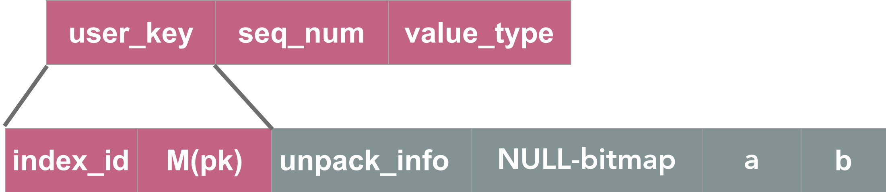
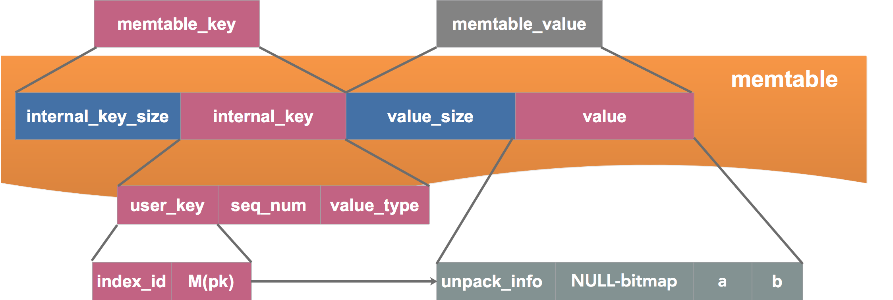
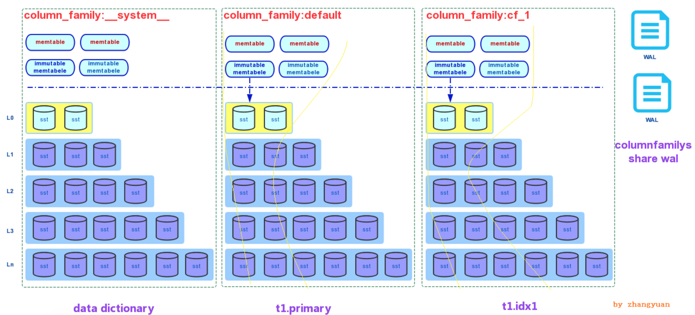

# 3 MyRocks 数据记录格式

## 3.1 记录格式

*   向表 t1 中插入一行数据

```java
mysql> SELECT * FROM t1;
+----+------+------+
| id | a    | b    |
+----+------+------+
|  1 |    1 | a    |
+----+------+------+
1 row in set (0.00 sec)
```

  

*   **主键索引记录**

```plain
key: index_id, M(pk)
value: unpack_info, NULL-bitmap,a,b
```


1.  index\_id：索引 ID，全局唯一，4B
2.  M(pk)：转化后的主键，转化后的 pk 可以直接 memcmp
3.  unpack\_info：pk 逆转化的信息
4.  NULL-bitmap： 表示为 NULL 的字段
5.  a/b：数据

**综上：数据与主键索引保存在一起，MyRocks 的主键索引为聚簇索引**

*   **二级索引记录**

```java
key: index_id,NULL-byte, M(b),M(pk)
value: unpack_info
```


1.  index\_id：二级索引 ID
2.  NULL-byte：索引 b 是否为空
3.  M(b)：转化后的二级索引
4.  M(pk)：转化后的主键
5.  unpack\_info：逆转化信息

## 3.2 索引转化

rocksdb为了比较方便，将key字段转化为可以直接memcmp比较的形式。

###  3.2.1 整型

需要考虑符号位

*   1 表示为：00000000 00000000 00000000 00000001
    *   0x00 00000000
    *   0x01 00000000
    *   0x02 00000000
    *   0x03 00000001
*   \-1 表示为：11111111 11111111 11111111 11111111
    *   0x00 11111111
    *   0x01 11111111
    *   0x02 11111111
    *   0x03 11111111

直接比较，则 -1 > 1，因此需要转化，规则为：0x00 ^ 128 (1000 0000)

*   1 表示为：  
    *   0x00 10000000  -> 0x80
    *   0x01 00000000  -> 0x00
    *   0x02 00000000  -> 0x00
    *   0x03 00000001  -> 0x01
*   \-1 表示为：
    *   0x00 01111111  -> 0x7F
    *   0x01 11111111  -> 0xFF
    *   0x02 11111111  -> 0xFF
    *   0x03 11111111  -> 0xFF

转化后可以直接比较 1 > -1

### 3.2.2 char

不足的位直接补空格 0x20

### 3.2.3 varchar

```java
const int VARCHAR_CMP_LESS_THAN_SPACES = 1;
const int VARCHAR_CMP_EQUAL_TO_SPACES = 2;
const int VARCHAR_CMP_GREATER_THAN_SPACES = 3;
 
 Example: m_segment_size=5, collation=latin1_bin:
 
  'abcd\0'   => [ 'abcd' <VARCHAR_CMP_LESS> ][ '\0    ' <VARCHAR_CMP_EQUAL> ]
  'abcd'     => [ 'abcd' <VARCHAR_CMP_EQUAL>]
  'abcd   '  => [ 'abcd' <VARCHAR_CMP_EQUAL>]
  'abcdZZZZ' => [ 'abcd' <VARCHAR_CMP_GREATER>][ 'ZZZZ' <VARCHAR_CMP_EQUAL> ]
```

## 3.3 key 的封装

*   **将 key 封装为 internal key**

1.  user\_key：key
2.  seq\_num：全局递增 sequence，用于 MVCC
3.  value\_type：put、merge、delete



*   **将 internal key 封装为 memtable key，memtable 中的最终数据格式**

  



## 3.4 插入一行数据

```java
mysql> SELECT * FROM t1;
+----+------+------+
| id | a    | b    |
+----+------+------+
|  1 |    1 | a    |
+----+------+------+
1 row in set (0.00 sec)
 
 
mysql> SELECT COLUMN_FAMILY,INDEX_NUMBER,SST_NAME FROM INFORMATION_SCHEMA.ROCKSDB_INDEX_FILE_MAP WHERE INDEX_NUMBER IN (SELECT INDEX_NUMBER FROM INFORMATION_SCHEMA.ROCKSDB_DDL WHERE TABLE_NAME = 't1');
+---------------+--------------+------------+
| COLUMN_FAMILY | INDEX_NUMBER | SST_NAME   |
+---------------+--------------+------------+
|             0 |          264 | 000134.sst |
|             4 |          265 | 000136.sst |
+---------------+--------------+------------+
```

*   主键索引：保存在 000134.sst
    


```java
'0000010880000001' seq:108, type:1 => 0001000000 6120202020202020
```

1.  key：0000010880000001
    1.  index\_id：264  -> 0x108 -> 0x00 0x00 0x01 0x08
    2.  M(pk)：1 -> 0x80 0x00 0x00 0x01，符号位翻转
    3.  seq：108
    4.  type：1 -> PUT
2.  value：00010000006120202020202020
    1.  NULL-bitmap：0x00 ，每一位对应一列，a\\b 两列均非空 -> 0x00
    2.  column a：0x01 0x00 0x00 0x00
        1.  数字1 大端表示形式
    3.  column b：0x61 0x20 0x20 0x20 0x20 0x20 0x20 0x20
        1.  'a' -> 0x61
        2.  补7个空格 -> 0x20

  

*   辅助索引：保存在 000136.sst


```java
'0000010901612020202020202080000001' seq:109, type:1 =>
```

1.  key：0000010901612020202020202080000001
    1.  index\_id：265 -> 0x109 -> 0x00 0x00 0x01 0x09
    2.  NULL-byte：0x01，标识字段 b 是否可以为NULL
    3.  M(b)：‘a\[ \]\*7’ -> 0x61  0x20 0x20 0x20 0x20 0x20 0x20 0x20
    4.  M(id)：0x80 0x00 0x00 0x01
    5.  seq\_num：109
    6.  type：1 -> PUT
2.  value：NULL
    1.  pack\_info：无需额外的逆转化信息，该字段为 NULL

## 3.5 数据分布



# 4 源码分析

*   操作类型，例如 delete 操作的 type 为 kTypeDeletion = 0x0

```java
// dbformat.h 定义的操作类型
// Value types encoded as the last component of internal keys.
// DO NOT CHANGE THESE ENUM VALUES: they are embedded in the on-disk
// data structures.
// The highest bit of the value type needs to be reserved to SST tables
// for them to do more flexible encoding.
enum ValueType : unsigned char {
  kTypeDeletion = 0x0,
  kTypeValue = 0x1,
  kTypeMerge = 0x2,
  kTypeLogData = 0x3,               // WAL only.
  kTypeColumnFamilyDeletion = 0x4,  // WAL only.
  kTypeColumnFamilyValue = 0x5,     // WAL only.
  kTypeColumnFamilyMerge = 0x6,     // WAL only.
  kTypeSingleDeletion = 0x7,
  kTypeColumnFamilySingleDeletion = 0x8,  // WAL only.
  kTypeBeginPrepareXID = 0x9,             // WAL only.
  kTypeEndPrepareXID = 0xA,               // WAL only.
  kTypeCommitXID = 0xB,                   // WAL only.
  kTypeRollbackXID = 0xC,                 // WAL only.
  kTypeNoop = 0xD,                        // WAL only.
  kTypeColumnFamilyRangeDeletion = 0xE,   // WAL only.
  kTypeRangeDeletion = 0xF,               // meta block
  kTypeColumnFamilyBlobIndex = 0x10,      // Blob DB only
  kTypeBlobIndex = 0x11,                  // Blob DB only
  // When the prepared record is also persisted in db, we use a different
  // record. This is to ensure that the WAL that is generated by a WritePolicy
  // is not mistakenly read by another, which would result into data
  // inconsistency.
  kTypeBeginPersistedPrepareXID = 0x12,  // WAL only.
  kMaxValue = 0x7F                       // Not used for storing records.
};
```

*   Internal Key 的比较：
    *   user key 升序比较
    *   sequence number 降序比较
*   在 memtable 中排序时，全局递增、局部递减，目的是保证 sequence number 大的数据（最新的数据）靠前存放，提高查找效率
*   因此，sequence number 是直接存放的，没有进行亦或等转化
*   ```plain
    dbformat.cc:111，就是想 memtable 中插入时，确定插入位置的 compare 方法
    ```
    

```java
int InternalKeyComparator::Compare(const ParsedInternalKey& a,
                                   const ParsedInternalKey& b) const {
  // Order by:
  //    increasing user key (according to user-supplied comparator)
  //    decreasing sequence number
  //    decreasing type (though sequence# should be enough to disambiguate)
  int r = user_comparator_->Compare(a.user_key, b.user_key);
  PERF_COUNTER_ADD(user_key_comparison_count, 1);
  if (r == 0) {
    if (a.sequence > b.sequence) {
      r = -1;
    } else if (a.sequence < b.sequence) {
      r = +1;
    } else if (a.type > b.type) {
      r = -1;
    } else if (a.type < b.type) {
      r = +1;
    }
  }
  return r;
}
```

*   write batch 中的 rep\_ 成员就是需要写入到 memtable 中数据，其中保存了 sequence number、count、data，其具体结构如下
*   write\_batch.cc:10 注释

```java
// WriteBatch::rep_ :=
//    sequence: fixed64
//    count: fixed32
//    data: record[count]
// record :=
//    kTypeValue varstring varstring
//    kTypeDeletion varstring
//    kTypeSingleDeletion varstring
//    kTypeRangeDeletion varstring varstring
//    kTypeMerge varstring varstring
//    kTypeColumnFamilyValue varint32 varstring varstring
//    kTypeColumnFamilyDeletion varint32 varstring
//    kTypeColumnFamilySingleDeletion varint32 varstring
//    kTypeColumnFamilyRangeDeletion varint32 varstring varstring
//    kTypeColumnFamilyMerge varint32 varstring varstring
//    kTypeBeginPrepareXID varstring
//    kTypeEndPrepareXID
//    kTypeCommitXID varstring
//    kTypeRollbackXID varstring
//    kTypeBeginPersistedPrepareXID varstring
//    kTypeNoop
// varstring :=
//    len: varint32
//    data: uint8[len]
```

# 5 会议总结

**1 CF 是否有个数限制？**

**答：**RocksDB 使用 map 来管理 CF 的信息，没有对 CF 的个数进行限制，但是，每个 CF 有独立的memtabl、SST 等数据文件，因此，物理上限制了 CF 的个数。

**2 latin1 是否支持中文？**

**答：**支持

```java
mysql> show create table t2\G                         
*************************** 1. row ***************************
       Table: t2
Create Table: CREATE TABLE `t2` (
  `name` varchar(255) COLLATE latin1_bin NOT NULL DEFAULT '',
  `age` int(11) DEFAULT NULL,
  `address` varchar(255) COLLATE latin1_bin DEFAULT NULL,
  PRIMARY KEY (`name`),
  KEY `idx_addr` (`address`) COMMENT 'cf_b'
) ENGINE=ROCKSDB DEFAULT CHARSET=latin1 COLLATE=latin1_bin
1 row in set (0.00 sec)
mysql> select * from t2;     
+-----------+------+---------+
| name      | age  | address |
+-----------+------+---------+
| 刘昭毅 |   20 | 北京  |
+-----------+------+---------+
1 row in set (0.00 sec)
```

**3 MyRocks 列的元信息如何管理？**

与 innodb 保持一致，使用了 table 类，table 对象的 fileds 保存了列的元信息，本质上是使用 frm 保存元信息。

**4 为什么二级索引记录的 key 中要包含主键，而不是将主键放到 value 中？**

**5 主键中包含 varchar 类型的列时，segment\_size=5 时，‘abcd’ 与 ‘abcd    ’经过转化是否相同，若相同，那么读取时怎样知道字符串中空格的个数？**

**答：**两个字符串相同，末尾的空格会被去掉，查询出来的数据末尾没有空格。

若 ‘abcd’ 与 ‘abcd    ’ 同时作为唯一主键，会报主键冲突。
