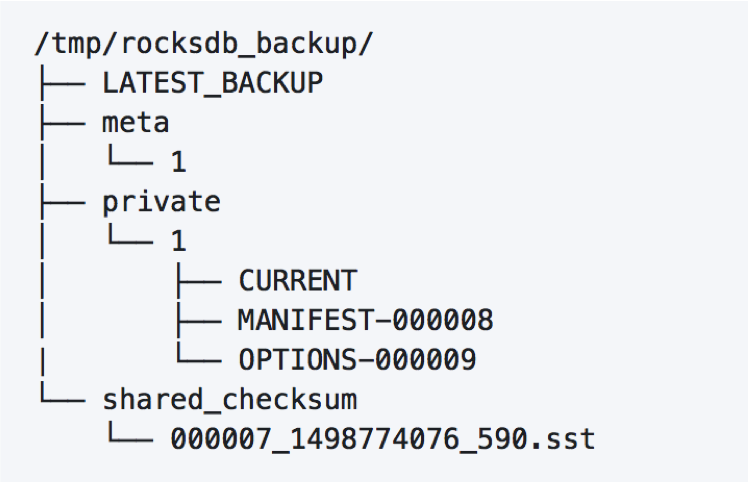

#1.Backup and Restore

 There are two distinct representations of backup engines: (1) BackupEngine for creating new backups, and (2) BackupEngineReadOnly for restoring from backup. Either one can be used to get info about backups.

When you call BackupEngine::CreateNewBackup():
1. Disable file deletions
2. Get live files (includes table files, current, options and manifest file).
3. Copy live files to the backup directory. Since table files are immutable and filenames unique, we don‘t copy a table file that is already present in the backup directory. For example, if there is a file 00050.sst already backed up and GetLiveFiles() returns 00050.sst, we will not copy that file to the backup directory. If flush_before_backup was set to false, we also need to copy log files to the backup directory. We call GetSortedWalFiles() and copy all live files to the backup directory.
4. Re-enable file deletions

#2.Create Snapshot

创建快照过程：
1.禁止SST文件的删除操作，创建空目录
2. Memtable刷盘
3. 在备份目录下为每个SST文件的创建硬链接
4. copy MANIFEST和OPTIONS文件到备份目录下
5. 备份WAL文件，最后一个WAL文件通过copy方式，其他WAL文件通过硬链接备份到备份目录
6. 允许SST文件的删除操作

#3.Backup

备份过程：
1.  用SET GLOBAL rocksdb_create_checkpoint 建立快照
2.  依次备份快照中的文件，先备份SST文件, 再备份WAL，MANIFEST和OPTIONS文件。备份SST过程会比较长，如果超过checkpoint_interval，SST文件还没有备份完，就会清理当前快照，返回步骤1重新开始。
3.  步骤1、2完成后，rocksdb相关的文件备份完成，清理最后一次checkpoint快照文件。
4.  开始备份mysql其他文件。
 