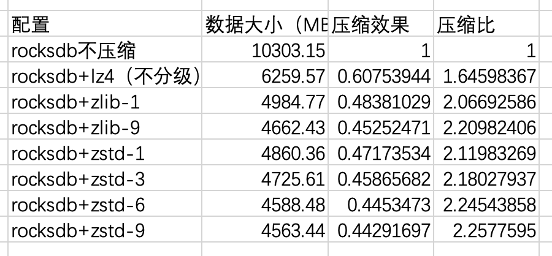
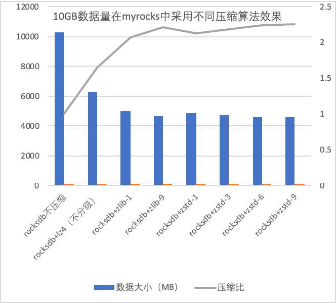
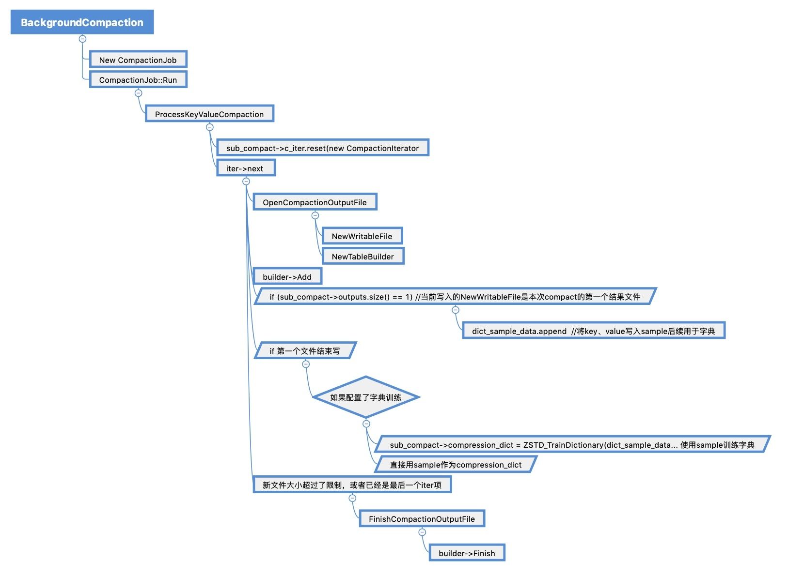
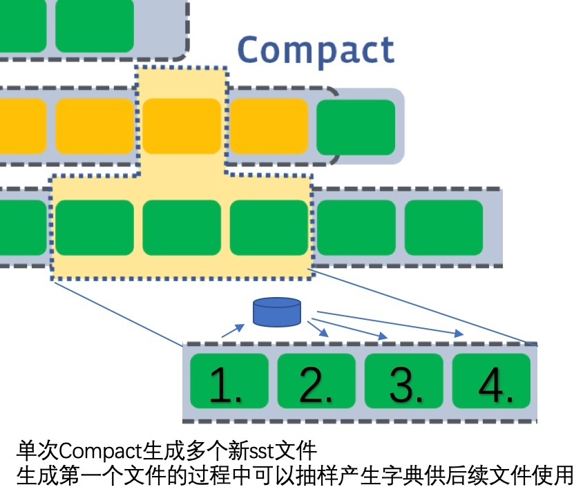

# [RocksDB 原理介绍：压缩功能优化]

# RocksDB 压缩功能优化

## 不同压缩策略对数据库大小的影响

MyRocks和RocksDB兼容多重压缩策略，且可以根据sst文件所处的不同level层指定不同压缩算法。由于数据最终回compact到最后一层，即bottom层（默认L6），我们只分析讨论对bottom层采用不同压缩算发，以及不同压缩级别对数据库大小的影响。

使用业务模拟数据进行测试，多个表dump出后的文本文件约10G。datablock为16K，且将所有数据compact到最后一层。  

  

从压缩率上来看，zstd仅仅是小胜zlib。但在更完善的测试中，zstd在读写性能和资源站用上都优于zlib。后续测试将在zstd-6下进行。

## Zstandard 原理简介

Zstandard（简称zstd） 使用的 LZ77，同时结合熵编码法的有限状态熵（tANS）  
其中，LZ77系列的压缩算法编码器和解码器都必须保存一定数量的最近的数据，如最近2 KB、4 KB或者32 KB的数据。保存这些数据的结构叫作滑动窗口，因为这样所以LZ77有时也称作滑动窗口压缩。

MyRocks和RocksDB都可以使用Zstandard的作为数据最小单位（block）落盘前的压缩算法，可以整体上取得优于30%的压缩效果，同时压缩和解压速率远超Zlib。

## Zstandard 创建额外字典优化压缩

前面提到zstd压缩数据时会使用滑动窗口中保存的数据，即当前压缩对象之前的一定数量的字符（前序窗口）。因此对短字符或批量的小文件（几KB或更小）压缩时，压缩效果可能达不到逾期。为了解决这个功能zstd提供了创建字典接口。即在对大量的短字符加密前，先进行数据采样组成字典，后续加密时，将使用字典进行编码比较。

有了字典后，没有足够组成前序窗口字符串的小文件也能取得较好的压缩效果。这里字典的质量就非常重要了，字典中的抽样字符数据应该具有足够的代表性，这样在后续文件的压缩中，带压缩字符串在和字典中数据比较时才能获得较大相似性。因此zstd的高版本中加入了对字典的训练功能（在zstd的v0.8版本以后有稳定集成，v1.3以后字典和字典训练得到进一步优化）。在生成最终字典前可以更大量的采样，然后通过训练接口进行采样数据的典型性过滤和优化最终形成字典。一般字典的大小不超过100k，但是训练前的采样量可以是其100倍大小。  
根据官方的测试，对批量小文件（1k左右）使用字典压缩，不仅压缩率有了较大提升，压缩和解压时间也显著缩短。

## MyRocks/RocksDB ZSTD与字典的集成

MyRocks/RocksDB底层存储默认使用BlockBasedTable格式，是支持zstd压缩以及字典等接口的。MariaDB也可以通过对适配部分的修改实现接口调用。根据Facebook的参数调配建议，一般只将zstd用在最后一层（L6）的压缩。另外MyRocks/RocksDB底层sst在压缩时是以一个datablock为单位压缩存取的（默认4K），使用字典有可能取得更好的压缩效果。

ZSTD的压缩发生在sst写过程。sst是基于文件级的操作，由TableBuilder等对象完成。单次的put写入并不一定会激发sst写文件。真正的调用来自backgroud flush 和backgroud compact（recover和repair的时候也会）。即将immutable memtable刷到L0层sst，以及sst文件的compact操作，会产生新的sst，触发sst写操作。  
由于L0层一般不采用压缩，所以ZSTD的压缩只发生在compact过程中。

其中的 ProcessKeyValueCompaction的 biulder->Add（BlockBasedTable::Add）的后续调用中，会在数据落盘前会调用CompressBlock，将每块rocksdb\_block\_size大小的datablock数据压缩。  
字典的创建同时在ProcessKeyValueCompaction中进行。在将迭代器返回的归并结果写入第一个新sst文件时，会通过采样缓存部分key-value键值对拼接到dict\_sample\_data（string类型），如果开启了字典训练功能，在第一个sst文件写完时，会将sample传入zstd的trainner接口训练更精炼且具有典型性的字典，否则直接拿sample作为字典。

在一次compact中，对于第一个sst文件，在其写完前，字典并没有完成，所以它在压缩落盘的时候并没有使用字典。第一个文件完成后，生成了字典，后续sst文件使用该字典优化压缩。  

使用业务模拟数据进行测试，多个表dump出后的文本文件约10G。datablock为16K，且将所有数据compact到最后一层，且使用zstd-6进行含字典压缩,查看不同字典和训练集大小对最终压缩后数据库大小的影响。

| 
datablock size

 | 

database size

 |
| --- | --- |
| NO dictionary | 4.48G |
| 1600K tainning data 16K dict | 4.47G |
| 6400K tainning data 64K dict | 4.48G |

使用sysbench生成数据，三张表，每张表1G，共3G数据。datablock设为4K。

| 
datablock size

 | 

database size

 |
| --- | --- |
| NO dictionary | 1.8G |
| skip data tainning,16K dict | 1.8G |
| 16K tainning data 16K dict | 1.8G |
| 32K tainning data 32K dict | 1.85G |
| 64K tainning data 64K dict | 1.92G |
| NO COMPRESSION | 8.69G |

我们将NO COMPRESSION情况下的sst文件导出，使用zstd压缩的api接口全局压缩，无论是否使用字典，压缩后文件的大小都在1.8G左右。

从数据来看，在当前配置下，使用字典对进一步提高压缩率效果不大。  
后期线上环境使用的datablock不会低于16K，对字典的需求下降。且因为设置  
target\_file\_size\_multiplier=2，sst层数约大，单块的容量越大（L6层单块sst将接近1G）。字典的典型代表性将因为这些参数条件受到挑战。

## 影响压缩的其他因素

Myrocks/Rocksdb 可以通过rocksdb\_xxx\_cf\_options配置中的compression\_per\_level、bottommost\_compression、compression\_opts等项对columnfamily名为xxx的数据进行压缩参数调配，如`compression_per_level=kNoCompression;bottommost_compression=kZSTD;ccompression_opts=-14:6:0:16K:1600K`。ccompression\_opts这个参数可同时作用于zlib、lz4、zstd。ccompression\_opts最多可以有4个值，其中第二个和后两个值对zstd有效，分别代表压缩机别（6，1-22，越大压缩效果越好，压缩时间和资源消耗也越多），字典最大size（16KB），字典训练前最大采样量（1600KB）。  
另外zstd是以sst中的datablock为单位进行压缩的，datablock的大小（rocksdb\_block\_size）直接影响压缩性能。适当调大rocksdb\_block\_size，可以取得更好压缩率。但因为BlockBasedTable读取单条key-value也需要读取和解压整块datablock，所以调大rocksdb\_block\_size会影响读性能(IO/CPU/内存)。

使用业务模拟数据进行测试，多个表dump出后的文本文件约10G。设置不同的datablock查看最终将所有数据compact到最后一层，且使用zstd-6进行无字典压缩的效果。

| 
datablock size

 | 

database size

 |
| --- | --- |
| 4K | 5.22G |
| 16K | 4.48G |
| 64K | 4.15G |
| 256K | 3.9G |
| 4M | 3.54G |

后期将关注更大规模数据下，增大datablock对压缩率以及系统资源占用的综合影响。

## 其他压缩思路

terakDB提出了全新的压缩思路，这部分内容在另一篇wiki《RockDB/Terark SST读写与压缩技术》中有更多分析。其核心除了将key和value分开压缩保存外，需要对数据进行两次扫描，第一次进行属性信息统计，生成压缩策略；第二次才进行真正压缩，是一种Grammar-Based Compressor。这种压缩算法原则上能更好根据数据特征进行压缩，但由于最佳语法(Optimal Grammar)问题被证明是NP-Hard，所以实现方法将对压缩效果有较大影响。

